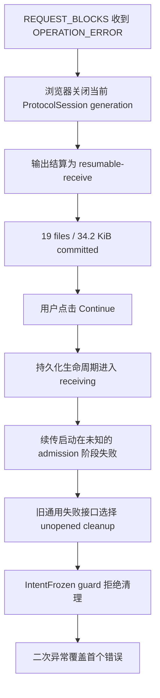

# 浏览器 FSA Continue 失败事件记录（2026-08-18）

状态：修复已实现。历史事件 428 的 wire error scope/code 因旧 trace 未记录响应分类，无法追溯。

## 摘要

浏览器接收目录时先在内容读取阶段中断，并保存了 19 个文件、34.2 KiB 的可续传进度。用户点击
Continue 后看到：

```text
unopened FSA abort requires IntentFrozen lifecycle state
```

这个提示是二次结算错误，不是最初的传输或续传启动错误。旧实现把不同失败边界压进同一个
`abandon → abortUnopened` 接口：Continue 已经把持久化生命周期推进到 `receiving`，而
`abortUnopened` 只允许清理 `intent-frozen`。它拒绝清理是正确的数据保护行为；错误在于调用方选择了
不适用的结算语义。

调查还确认了一个独立的 Go↔TypeScript 协议不一致：`REQUEST_BLOCKS` 可以合法收到 block-scope 或
revision-scope `OPERATION_ERROR`，但浏览器的两个错误入口都只接受 block scope。事件 428 很可能命中
这一缺陷，但旧 sender trace 没有 scope/code，不能把“很可能”升级为事实。

已提交进度不受这次修复影响。修复不会放宽清理保护，也不会删除接收状态；Continue admission 失败时会恢复
原 checkpoint、完成计数和原到期时间。

## 已确认事实

### 时间线

`sender.ndjson` 使用 UTC；下表已换算为 UTC+8。到期时间来自浏览器持久化生命周期，不属于 sender
trace。

| 本地时间 | Trace 序号 | 事件 | 含义 |
|---|---:|---|---|
| 16:18:50 | 1 | sender trace 开始 | 本次 `share` run 建立 |
| 16:20:39–16:21:35 | 12–224 | 两个 catalog session 执行 `list_children` | 渐进目录发现正常 |
| 16:22:27–16:22:32 | 226–323 | 内容会话执行 `open_revisions`、`release_lease` 并建立 peer lane | 首轮接收进行中 |
| 16:24:23 | 324–326 | 旧 WebRTC `remote_closed`，relay session retired | 当前 generation 被替换或退役 |
| 16:25:57–16:25:58 | 327–350 | 新 protocol session、peer offer、lane attach 成功 | direct 与 relay 均可用 |
| 16:26:01.904 | 428 | `request_blocks` 以 `operation_error` 结束 | sender 明确拒绝一个块请求 |
| 16:26:02.163 | 429–430 | WebRTC `remote_closed` | 浏览器关闭当前 direct lane |
| 16:26:02.268 | 431 | relay session retired | 同一 protocol session 结束 |
| 约 16:26:08 | — | `resumable-receive` 落盘 | 根据固定 24 小时期限倒推，与 UI 到期时间一致 |
| 其后 | — | 用户点击 Continue，看到 FSA 生命周期错误 | trace 中没有可明确归属的新内容请求 |
| 16:29:17–16:29:19 | 432–435 | sender relay link 失败后自动恢复 | 晚于主要失败，不是 16:26 内容错误的起点 |

成功的 `request_blocks` 属于热路径，trace 会刻意省略；只看到失败请求不表示此前没有传输文件。

### UI 数字

- `19 file(s)` / `34.2 KiB committed` 表示已有持久化完成证据。
- `At least 113` 是目录扫描中止前的发现下限，不是最终文件总数。
- `final total unknown` 表示渐进发现尚未封口，不表示已提交字节未知。
- `0 branch(es) failed` 只统计目录发现分支，不覆盖内容 operation、会话或输出结算错误。
- `Available until ...` 是 checkpoint 的原保留期限，不是 sender 连接健康证明。

### Sender trace 与源目录

- `cmd/wind/sender.ndjson` 共 435 行，均可解析为 JSON。
- 430 条为 `debug`、5 条为 `info`；`operation_error` 是经过认证的协议业务终态，日志级别不能证明
  “没有错误”。
- 旧事件 428 没有 scope、code、retryable 或 retry-after，因此无法区分 `invalid-lease`、
  `lease-expired`、`revision-drift` 或 block-local failure。
- 事件后的只读检查发现 582 个文件、103 个目录、6,762,858 bytes、0 个 reparse point；分享窗口内没有
  `LastWriteTime` 变化。这降低了普通源文件修改的可能性，但不能替代 wire error code。

## 结论边界



已确认：

- 事件 428 是 `request_blocks → operation_error`，随后当前协议会话关闭并形成可续传状态。
- 旧浏览器协议矩阵拒绝合法的 revision-scope block-request error。
- 旧 Continue 路径会先持久化 `receiving`；旧通用失败接口可能在该状态调用仅适用于 unopened intent 的
  FSA 清理。
- 用户看到的 `IntentFrozen` 断言来自二次结算边界，并会掩盖第一错误。

无法从现有证据确认：

- 事件 428 的准确 scope/code，以及它是否就是本次浏览器会话关闭的直接原因。
- Continue 首个启动错误发生在 protocol generation、connectivity、FSA session 还是 plan admission。
- 该次点击具体经过哪个异步 rejection 分支。缺少当时的 receiver trace，代码可达路径不能代替运行时证据。

## 根因

### 协议错误矩阵分叉

Go sender 对 `REQUEST_BLOCKS` 的契约是：

- lease/revision 问题返回 revision scope；
- block-local 问题返回 block scope。

Go receiver 已接受两种 scope。旧浏览器却在 session continuation router 和 content service 两处分别维护
“只允许 block”的规则，导致合法 revision error 被升级成 session protocol failure。

### 失败结算所有权不清

旧 `abandon` 同时表示：

- intent 已冻结、execution 尚未打开时的安全放弃；
- Continue admission 失败后的补偿；
- transfer promise rejection 后的稳定结算。

这些语义拥有不同的合法状态和数据权限。控制器无法表达失败发生在哪个边界，FSA adapter 只能选择过窄的
`abortUnopened`，随后由状态保护拒绝。

Fresh-page Continue 还有一个事务缺口：reopen authority 先提交 `resume-started`，却没有把原
`resumable-receive` 快照传给随后创建的 runtime，所以 runtime 即使识别到 admission 失败也无法做精确补偿。

## 已实施修复

### 单一 operation-error 契约

`web/src/session/v2-operation-error-contract.ts` 现在集中定义 request kind 到合法 scope 的矩阵。session
router 和 content service 共用该契约；`REQUEST_BLOCKS` 接受 block/revision，其他 request 仍保持各自的
封闭 scope。

合法的 revision-scope error 会保留为 operation failure，不再仅因 scope 合法变化关闭整个 session。

### Continue admission 成为显式事务

- Same-page Continue 在离开稳定状态前先创建 FSA attempt；前置创建失败时根本不提交 `receiving`。
- Fresh-page reopen 把原 `resumable-receive` 快照作为显式 admission fallback 传到 FSA 或 workspace
  runtime。
- 新的 `resume-admission-failed` 生命周期事件只允许紧邻原 fallback generation 的 `receiving` 使用，
  并恢复原 checkpoint digest、完成计数、可选 partial receipt 和原 `expiresAt`。
- 若 output materialization 已绑定，系统不会假装回滚；它转入 `needs-attention`，保留人工恢复所需状态。

这使一次 Continue 的结果封闭为：成功返回 active authority；未绑定输出时恢复原稳定 checkpoint；状态不再
可安全判定时进入 `needs-attention`。

### TransferJob 与控制器各守一个边界

`TransferJob` 负责 intent 已验证后的 pause/partial/unknown settlement，并以
`TransferJobResult` 返回稳定生命周期。它只把 intent 验证前的失败标记为
`V2TransferAdmissionFailureError`。

`ActiveReceiveCoordinator` 只在同步 job 构造失败或收到这个显式 admission error 时调用 runtime admission
settlement。普通 job rejection 不再被重新解释为 unopened cleanup；已结算结果会先发布 durable lifecycle，再
报告原始 transfer error。

### 保留首个错误

`V2TransferFailureSettlementError` 以原始 transfer/startup error 为主错误，把后续 settlement failure
作为有界次级原因。即使诊断展示回调自身失败，也不能覆盖已经发布的首个错误。

### 安全可观测性

Go sender/receiver protocol operation trace 新增：

- `protocol_error_scope`
- `protocol_error_code`
- `protocol_error_retryable`

字段只来自认证后的封闭枚举，不记录 provider message、路径、文件名或 capability material。成功
`request_blocks` 仍保持热路径省略。该改动只能帮助未来事件，不能补回事件 428。

## 回归覆盖

新增或更新的测试覆盖：

- `REQUEST_BLOCKS` 的 revision-scope error 在 router 和 content service 中均被接受，且不会关闭 session；
- Continue admission 失败恢复原 checkpoint、完成计数和到期时间；
- materialization 已绑定时进入 `needs-attention`；
- fresh-page FSA/workspace reopen 保留 admission fallback；
- pause/stop 由 `TransferJobResult` 发布稳定状态，不触发 admission cleanup；
- 未分类 job rejection 不会被控制器误判为 admission failure；
- settlement 再失败时仍向用户保留第一原因；
- Go trace 和 CLI NDJSON 只投影安全的 protocol error 分类字段。

本事件仍缺一条真实 Pion sender、双 lane、浏览器 FSA、暂停后 fresh-page Continue 的产品级端到端回归。
单元和组件边界已经封闭，但该场景应继续纳入浏览器网络矩阵。
