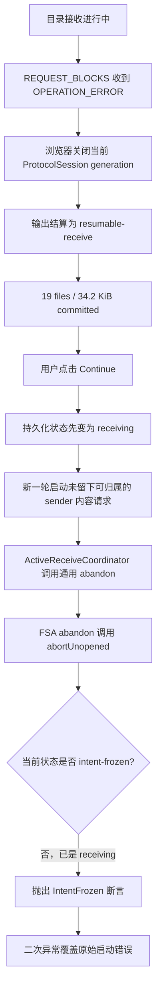

# 浏览器 FSA 续传失败事件记录（2026-08-18）

状态：生命周期错误掩盖问题已确认；首次内容失败的 wire error scope/code 因现有 trace 缺字段而尚未完全确认。

## 摘要

浏览器接收目录时先在内容读取阶段中断，并把 19 个已完成文件保存为可续传状态。用户随后点击
Continue，页面显示：

```text
unopened FSA abort requires IntentFrozen lifecycle state
```

这条消息不是最初的内容失败，而是错误收尾再次失败后覆盖出来的二次异常。FSA 已经从
`resumable-receive` 进入 `receiving`，通用控制器却调用了只适用于“尚未打开输出”的清理路径；该路径的
状态保护正确拒绝在活动接收状态下清理。

当前证据支持把事件分成两段：

1. 发送端在 16:26:01 对一个 `request_blocks` 返回 `operation_error`，浏览器随后关闭当前协议会话，
   并约在 16:26:08 持久化可续传状态。
2. 用户点击 Continue 后，sender trace 没有留下可明确归属的新内容请求；通用 `abandon` 路径错误调用
   `abortUnopened`，最终向用户展示了生命周期断言，而不是这次启动失败的原始错误。

已提交的 19 个文件和 34.2 KiB 不是该断言创建的临时统计。界面明确把它们报告为 committed；修复应保留
这些进度，不能通过放宽清理保护或删除接收状态绕过问题。

## 事件背景

发送端以目录分享模式运行，并启用详细结构化 trace：

```text
windshare.exe share <source-directory> \
  --relay <relay-url> \
  --front-url <front-url> \
  --verbose \
  --trace sender.ndjson
```

本文不保存完整分享链接。URL fragment 中含 suite-02 capability key，复制到长期维护文档会把文档本身变成
访问凭据。

浏览器在第一次中断后显示：

```text
Ready to continue receiving
19 file(s) and 34.2 KiB are complete.
Available until 2026/8/19 16:26:08
```

点击 Continue 后，页面保留活动接收投影并显示：

```text
Pause and keep verified progress
34.2 KiB received · 19 file(s) completed
(34.2 KiB committed; final total unknown)
At least 113 file(s), 2.0 MiB discovered; 0 branch(es) failed
```

同时出现 `unopened FSA abort requires IntentFrozen lifecycle state`。

## 时间线

`sender.ndjson` 使用 UTC；下表已换算为 UTC+8。到期时间来自浏览器持久化生命周期，不属于 sender trace。

| 本地时间 | Trace 序号 | 事件 | 含义 |
|---|---:|---|---|
| 16:18:50 | 1 | sender trace 开始 | 本次 `share` run 建立 |
| 16:20:39–16:21:35 | 12–224 | 两个 catalog session 执行 `list_children` | 渐进目录发现正常进行 |
| 16:22:27–16:22:32 | 226–323 | 内容会话执行 `open_revisions`、`release_lease` 并建立 peer lane | 首轮文件接收进行中 |
| 16:24:23 | 324–326 | 旧 WebRTC `remote_closed`，relay session retired | 当前 generation 被替换/退役 |
| 16:25:57–16:25:58 | 327–350 | 新 protocol session、peer offer、lane attach 成功 | direct 与 relay 均可用 |
| 16:26:01.904 | 428 | `request_blocks` 以 `operation_error` 结束 | sender 明确拒绝一个块请求 |
| 16:26:02.163 | 429–430 | WebRTC `remote_closed` | 浏览器关闭当前 direct lane |
| 16:26:02.268 | 431 | relay session retired | 同一 protocol session 结束 |
| 约 16:26:08 | — | `resumable-receive` 落盘 | 根据固定 24 小时期限倒推；与 UI 到期时间一致 |
| 其后 | — | 用户点击 Continue 并看到 FSA 生命周期错误 | trace 中没有可明确归属的新 `open_revisions`/`request_blocks` |
| 16:29:17–16:29:19 | 432–435 | sender relay link 失败后自动恢复 | 晚于主要失败，约 1.6 秒恢复，不是 16:26 内容错误的起点 |

成功的 `request_blocks` 属于传输热路径，协议 trace 会刻意省略；因此只看到失败的块请求并不表示此前没有
传输文件。该策略记录在 `docs/windows-checkpoint-resume-incident.md`。

## 界面数字如何解释

- `19 file(s)` / `34.2 KiB committed` 表示已经建立持久化完成证据的文件和字节。
- `At least 113` 是发现下限。目录扫描在最终总量确定前中止，所以不能与源目录文件总数直接比较。
- `final total unknown` 是渐进发现尚未封口，不代表已提交字节未知。
- `0 branch(es) failed` 只统计目录发现分支，不覆盖内容 operation、协议会话或输出结算错误。
- `Available until ...` 是可续传状态的保留期限；它不是 sender 分享进程的连接健康证明。

## 证据与排除项

### Sender trace 完整性

- 本地 `cmd/windshare/sender.ndjson` 共 435 行，435 行均可解析为 JSON。
- 级别为 430 条 `debug`、5 条 `info`，没有 `warn`/`error`。
- `operation_error` 是经过认证的协议业务终态，目前以 `debug` 记录；不能用日志级别判断“没有错误”。
- 事件 428 没有保留 operation-error scope、code、retryable 或 retry-after，因此仅凭 sender trace 无法区分
  `invalid-lease`、`lease-expired`、`revision-drift` 或 block-local failure。

### 源目录检查

事件发生后对源目录做了只读检查：

- 582 个文件，共 6,762,858 bytes；
- 103 个目录；
- 0 个 reparse point；
- 从 16:18:50 到 16:26:05，没有文件或目录的 `LastWriteTime` 落在分享窗口内。

这些事实降低了“分享期间源文件发生普通修改/重命名”的可能性，但不能证明没有瞬时修改后恢复时间戳，也
不能替代 sender 返回的准确 operation-error code。

### 网络状态

16:25:58 已完成 WebRTC admission，并报告两个 usable lanes。16:26:01 的 `operation_error` 是 sender 已送达
的协议响应，不是简单的 WebSocket 断线。16:29 的 relay link failure 自动恢复，发生在主要失败之后。

## 两段失败链



其中 B→C 的具体浏览器错误分类仍缺 receiver trace；F→M 可由当前控制器与 FSA 调用链直接确认。

## 已确认的生命周期缺陷

调用链如下：

1. `web/src/ui/controller/active-receive.ts` 的 `#settleTransferFailure` 对当前 runtime 无条件调用
   `runtime.abandon(error)`。
2. `web/src/ui/browser-receive/fsa.ts` 的 `FSAReceiveOperation.abandon` 无条件调用
   `this.#settlement.abortUnopened(...)`。
3. Continue 已通过 `resume-started` 把持久化状态从 `resumable-receive` 推进到 `receiving`。
4. `web/src/output/file-system-access/settlement.ts` 的 `abortUnopened` 只接受 `intent-frozen`，因此抛出：

   ```text
   unopened FSA abort requires IntentFrozen lifecycle state
   ```

`abortUnopened` 的保护条件本身是正确的。它防止“尚未打开输出”的清理语义删除或覆盖已经进入活动接收的
持久化状态。直接允许 `receiving` 通过该分支会把二次错误变成潜在数据清理错误。

根因是 `abandon` 同时承担了两个不正交语义：

- 冻结 intent 后、plan execution 尚未打开时的安全放弃；
- 活动或续传 execution 失败后的稳定结算。

控制器无法从这个接口表达当前失败边界，FSA adapter 只能错误地选择“unopened”清理。

## 已确认的 Go↔浏览器协议不一致

代码中还存在一个与 16:26:01 高度匹配的跨实现缺陷：

- Go sender 的 `core/session/contentflow/handler.go` 允许 `REQUEST_BLOCKS` 因 lease/revision 问题返回
  revision-scope `OPERATION_ERROR`，因 block-local 问题返回 block-scope。
- Go receiver 的 `core/session/sessionruntime/outbound_protocol.go` 在块请求上明确接受 block 或 revision scope。
- Go 测试 `TestBlockHandlerKeepsRevisionFailuresOutOfTheBlockErrorDomain` 明确要求 revision drift 和 unknown lease
  保持 revision scope。
- 浏览器 `web/src/content/v2-session-services.ts` 却调用
  `remoteOperationErrorFor(..., 'block')`，收到合法的 revision scope 时会关闭整个 session，并报告
  “Authenticated operation error belonged to another operation scope”。

这是已确认的实现不兼容，但当前事件是否恰好命中该分支仍属于高可信推断，不是闭环事实。原因是事件 428
只记录了 `request_blocks → operation_error`，没有记录响应 body 中的 scope/code；正在接收的浏览器标签页也未能
提供原始 console/receiver trace。

## 为什么 Continue 没有恢复

到期时间表明可续传状态约在 16:26:08 才建立，而 sender 的失败块请求发生在 16:26:01。因此事件 428 更像
“进入可续传状态的前因”，不能直接当作用户点击 Continue 后的新请求。

当前 sender trace 中没有看到 Continue 后可明确归属的新 `open_revisions`。这说明续传至少没有推进到 sender
内容操作边界。原始本地启动失败可能来自 protocol generation、connectivity activation、plan execution admission
或其他浏览器协作者；它随后被 `abortUnopened` 的二次异常覆盖，现有证据无法再恢复其准确类型。

## 数据安全与当前处置

- 保留接收目标目录、浏览器站点数据和 `sender.ndjson`。
- 不要为绕过错误而删除已完成文件、清除站点存储或手工修改 IndexedDB 生命周期记录。
- 不要反复点击 Continue；当前页面投影可能仍显示 `receiving`，但失败后的 transfer authority 未必仍存在。
- 在修复版本可用前保持 sender 可用，有助于保留恢复机会；停止 sender 不会破坏已提交文件，但会使续传无法
  重新取得内容。
- 如需临时完成下载，可使用具有独立输出目录的 native receiver 重新接收；这不是对浏览器 FSA checkpoint
  的修复，也不会复用浏览器已保存的 19 个文件。

## 正确修复方向

### 统一 operation-error 语义

浏览器块请求必须像 Go receiver 一样接受合法的 block/revision 两种 scope，并把 revision code 映射到文件版本、
lease 或可重试源错误。合法 revision-scope 不能仅因请求 kind 是 `REQUEST_BLOCKS` 就升级为 session protocol
failure。

该规则应来自共享协议契约或跨语言向量，避免 Go sender、Go receiver 和 TypeScript receiver 分别维护不同矩阵。

### 重构续传与失败结算所有权

控制器不应在任意 transfer promise rejection 后调用语义模糊的 `abandon`。运行时 API 应区分：

- unopened intent 的显式清理；
- 已打开 plan execution 的 pause/partial/unknown settlement；
- Continue admission 尚未完成时回到原 `resumable-receive` 的补偿。

更稳妥的模型是让一次 Continue transaction 同时拥有“当前 protocol generation、FSA session、plan execution 和
`resume-started` 生命周期提交”。它要么返回可运行的 active authority，要么保持/恢复原稳定状态；控制器不应先
发布 `receiving`，再独立启动一个可能同步失败的 job。

### 保留首个安全错误

若稳定结算本身失败，诊断应保留原始 transfer/startup error，并把 settlement error 作为有界 cause；不能只向用户
展示最后一次清理断言。

### 补全可观测性

失败的协议终态应增加有界字段：

- `protocol_error_scope`
- `protocol_error_code`
- `protocol_error_retryable`
- 可选、已归一化的 settlement/startup stage

这些字段不需要路径、文件名、provider 文本或 capability material，也不应恢复成功 `request_blocks` 的逐块日志。

## 回归覆盖

需要覆盖以下真实边界：

- Go sender 对 `REQUEST_BLOCKS` 返回 revision-scope error，浏览器按 code 处理且不因 scope 合法变化关闭 session；
- `invalid-lease`、`lease-expired`、`revision-drift` 与 block-local error 的跨语言矩阵；
- `resumable-receive → Continue` 在 plan execution 打开前失败，仍保留原 checkpoint 和稳定生命周期；
- 活动 FSA execution 失败时只调用 active settlement，绝不调用 `abortUnopened`；
- settlement 再失败时，用户诊断仍保留第一原因；
- Pion sender、relay/WebRTC 双 lane、浏览器 FSA、暂停后 Continue 的端到端场景。

调查期间已运行：

```text
go test ./core/session/contentflow \
  -run '^TestBlockHandlerKeepsRevisionFailuresOutOfTheBlockErrorDomain$' \
  -count=1
```

结果通过，证明 Go sender 对 revision-scope 的当前契约是有意行为。

```text
cd web
npm test -- test/content/v2-session-services.test.ts
```

现有 6 个 browser content-lane 测试全部通过，但没有覆盖 `REQUEST_BLOCKS` 收到 revision-scope
`OPERATION_ERROR` 的场景，这正是当前覆盖缺口。
