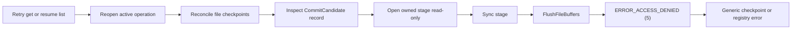

# Windows checkpoint resume failure after an interrupted download

Status: root cause confirmed on 2026-08-17; the retained download state is recoverable after the runtime fix.

## Summary

An interrupted Windows CLI download retained one in-progress file checkpoint correctly, but every later `get` failed before transferring data and `resume list` could not enumerate the operation. The network paths, destination binding, operation registry, and operation record were healthy.

The failure is in candidate checkpoint reconciliation. Recovery reopens the owned stage with a read-only Windows handle and then calls `Sync`. Go implements that operation with `FlushFileBuffers`; Windows rejects it with `ERROR_ACCESS_DENIED (5)` because the handle lacks write access.

This is a runtime access-model defect, not destination corruption. Do not delete `.windshare-output` or discard the operation merely to bypass it.

## User-visible sequence

The first observed transfer stopped after 49.3 seconds with one file and 5.4 MB downloaded:

```text
Download paused after 49.3s
1 downloaded | 5.4 MB
Reason: The operation timed out.
```

The sender remained connected but reported a generic unexpected error followed by `Trace is incomplete`. This warning was later confirmed to come from the diagnostics pipeline, not the transfer path.

A later reproduction transferred 106 files and 68.0 MB before interruption:

```text
Protocol operation peer offer failed after 1m 6s on lane 1 epoch 0 (canceled).

Download paused after 1m 7s
106 downloaded | 68.0 MB
Reason: The operation was interrupted.
```

Two subsequent invocations failed after about 0.6 seconds, before downloading any bytes:

```text
0 downloaded | 0 B
Reason: The recovery checkpoint could not be updated safely.
```

The corresponding recovery command also failed:

```text
resume_list_status="needs-attention" reason="destination-or-registry-unverified"
resume list: destination state could not be verified; no objects were changed
```

## Evidence and exclusions

### Network delivery was not the retry blocker

The first sender session showed that relay and WebRTC were both healthy before the interruption:

- the WebRTC data channel opened in approximately 478 ms and lane 2 epoch 1 was admitted in approximately 574 ms;
- relay lane 1 delivered seven `list_children`, 63 `open_revisions`, and 45 `release_lease` requests;
- WebRTC lane 2 delivered two `list_children`, 44 `open_revisions`, and 62 `release_lease` requests;
- operations on the two lanes overlapped, and the runtime reported two usable lanes after adaptive relay admission;
- WebRTC remained open for about 65 seconds and reported `remote_closed` only when the receiver was interrupted; relay subsequently completed the final observed lease release.

In `auto` mode, the receiver initially suspends relay content admission while preferring the direct lane. After the eight-second adaptive window, the visible state changes from `Direct` to `Direct + Relay`. That state means both transports are content-capable; it is not a fallback warning and does not prove a byte split by itself.

Successful `request_blocks` operations are deliberately omitted from protocol traces because they are the transfer hot path. The default lane race width is one, so one block demand is assigned to one lane rather than duplicated across both; independent concurrent blocks may still run on different lanes. The retained trace proves concurrent healthy lane use, but it cannot attribute the 68.0 MB total between relay and WebRTC.

The canceled peer-offer diagnostic occurred during termination. It did not explain why later invocations rejected local recovery state before content transfer.

### The sender warning was a trace-contract defect

The first normal relay send exposed a mismatch between the relay lifecycle producer and its CLI projection:

1. `relayv2` emits `LifecycleSendAdmitted` for a successful send while leaving `Cause` and `DrainCause` at their zero string values.
2. `ProjectRelayLifecycle` requires both values to map through the closed lifecycle-cause enum.
3. The mapper accepts the explicit value `none` but rejects the zero value.
4. `shareObservations.emitProjected` drops the event, reports observer loss, and publishes one generic `FailureUnexpected` warning.

This explains both user-visible lines:

```text
Warning: An unexpected error occurred.
Warning: Trace is incomplete.
```

The transfer continued because observation has no transport authority. The incomplete sender trace omitted successful relay send lifecycle records; explicit retirement records remained projectable because they carried normalized causes.

The later `fallback` records classified as `unexpected` belong to the two immediate retry sessions. Those receivers closed while peer negotiation was still in progress because local checkpoint admission had already failed. Treating that shutdown as an unclassified transport fallback is a separate diagnostics-classification defect, not evidence that the first WebRTC session failed.

### The trace did not retain the first receiver failure

The second invocation reused `--trace receiver.ndjson`. Trace creation truncates an existing file, so the long first receiver run was overwritten. The surviving receiver traces cover only the two immediate failures.

Both surviving traces reported:

```text
failure_code=checkpoint_state_io
message_key=checkpoint_failed
fault_domain=checkpoint
fault_scope=output_pause
```

They also reported `lifecycle_dropped=15` and `trace_incomplete=true`. The CLI filesystem projection retained the generic failure but omitted the underlying runtime component, operation, decision, and native cause.

### CLI messages were broader than the underlying state

`reportGetOutputAdmissionFailure` maps a needs-attention admission result to the same `checkpoint_state_io` presentation used for checkpoint failures. Therefore the message alone cannot distinguish admission state from repository I/O.

Likewise, `resume list` maps errors from destination opening, registry paging, operation acquisition, snapshot reconciliation, and close into the same `destination-or-registry-unverified` reason. It is a catch-all rather than evidence that the destination or registry was invalid.

### Destination and operation authority were healthy

`get` binds the filesystem output authority before connecting to the relay. The retries reached `Relay connected`, proving that destination binding had already succeeded.

The private registry had the expected shape:

```text
ordinary-v1/
  operations/<operation-id>/{record,files/}
  active/<active-key>/<operation-id>
  leases/{<operation>.operation.lock,<claim>.claim.lock,<active>.active.lock}
  claims/<claim-id>
  candidates/<active-key>/
```

The lock files are durable lock coordinates; their presence does not mean a process currently owns the locks. The empty admission-candidate directory is also expected after publication.

No `.candidate-*` installation file remained next to the operation record.

The operation record decoded to:

```text
Length:     856
Generation: 8
Lifecycle:  1  (active)
Lease:      1  (released)
Reason:     1  (none)
```

Generation 8 and the released lease show that repeated lease transitions completed. The operation was neither quarantined nor marked as ownership-unknown. This moved the failure boundary below operation recovery and into per-file checkpoint reconciliation.

### One semantic checkpoint candidate remained

The stable file checkpoint records were:

```text
Count  Phase  Commit  Meaning
1      2      1       active / candidate
106    5      3       published / published
```

The single active candidate was:

```text
records/4c/4c19c0b199e3b3e765a6cee7a5b2edde6412744c38a172d833d8840bba13f1ff.checkpoint
Length: 609
Phase:  2  (active)
Commit: 1  (candidate)
```

This state is expected after an interruption at the candidate durability boundary. It should be reconciled on the next process start.

The two uses of "candidate" are distinct:

- `.candidate-*` is a temporary filename used while atomically installing a record image;
- `CommitCandidate` is a durable semantic state stored inside the fixed `.checkpoint` record.

The absence of the first does not exclude the second. The incident is caused by the semantic `CommitCandidate` record.

## Confirmed root cause

The failure path is:



The relevant implementation chain is:

1. `checkpointstore.(*FileExecutionStore).candidateDurable` calls `openOwnedLocked(..., validateSize=true, writable=false)`.
2. `openOwnedLocked` passes `writable=false` when opening the stage.
3. The Windows output capability selects `windowsV3ReadFileAccess`, which contains read access but no write access.
4. `candidateDurable` calls `file.Sync()` after confirming that the stage and anchor identify the expected durable object.
5. `windowsV3File.Sync` delegates to `os.File.Sync`.
6. Go delegates Windows `Sync` to `syscall.Fsync`, which calls `FlushFileBuffers`.
7. Windows returns `ERROR_ACCESS_DENIED (5)` for this read-only handle.

A local read-only-handle probe reproduced the native behavior independently:

```text
Success    : False
Win32Error : 5
```

The one `CommitCandidate` record ensures this path is executed in the affected recovery. The other 106 published records do not need candidate durability promotion and therefore do not trigger it.

## Why the observed state remains consistent

Recovery first acquires the operation lease and advances its generation. It then reopens the top-level destination and creates a file execution store. The store calls repository reconciliation, which reaches the active candidate and fails during the read-only stage flush.

Operation cleanup still releases the lease, so the record returns to `active + released + none`. This explains all observed facts at once:

- destination binding succeeds;
- relay connection succeeds;
- no bytes are requested on a retry;
- the operation generation advances;
- the operation does not become needs-attention;
- `resume list` fails while building its snapshot;
- the same retained state fails deterministically on every attempt.

## Impact

On Windows, an interrupted transfer can become temporarily non-resumable when it retains a valid candidate checkpoint whose stage and anchor are ready for durability verification.

Affected commands include:

- repeated `windshare get` for the same selection and destination;
- `windshare resume list`, because listing reconciles operation snapshots;
- discard flows that depend on obtaining the same inventory snapshot.

Published files and the operation registry remain authenticated. The retained private state is evidence needed for recovery and should be preserved until a fixed binary reconciles it.

## Required fixes and convergence

### Checkpoint recovery authority

The native access model should distinguish these purposes explicitly:

- observation-only access;
- recovery durability access, which exposes synchronization but not data mutation to higher layers;
- writable transfer-stage access.

Passing the existing generic `writable=true` flag would happen to provide a flush-capable Windows handle, but it would preserve the semantic ambiguity that caused the defect. A recovery-specific capability or access purpose should request the minimal native rights required by `FlushFileBuffers` while exposing only the operations recovery is allowed to perform. The anchor remains observation-only.

The recovery repair should cover:

- an actual Windows native test proving that candidate recovery can flush its stage;
- a contract test proving that recovery receives synchronization authority without gaining a data-write API;
- interrupted-transfer recovery with an active `CommitCandidate` record;
- `get` and `resume list` behavior over the same retained operation;
- stable, bounded trace fields for reconciliation stage and failure code.

### Transport and trace semantics

Relay lifecycle observations should be constructed through a stage-aware API that assigns explicit `none` values to non-failure causes and prevents invalid stage/field combinations. Every lifecycle stage emitted by relay and WebRTC should have a projection contract test; a tolerant projector alone would hide malformed producer events rather than repairing the source contract.

Successful ordinary relay sends must not emit one lifecycle observation per frame. Relay should follow the existing WebRTC and protocol-operation policy: retain failures, terminal ownership, rollback, retirement, and bounded loss summaries while suppressing successful transfer-hot-path events. This removes the current per-frame callback and projection work that occurs even though the records are discarded.

To distinguish path availability from actual data use without adding hot-path logs, emit bounded per-lane settlement summaries containing stable session/lane identities and aggregate block, byte, failure, and reassignment counters. `Content path: Direct + Relay` should remain a capability-set transition, while the summary answers whether and how much each lane delivered.

Observer loss should identify a bounded event category and projection reason instead of collapsing every defect into `unexpected`. Peer attempts terminated by receiver runtime or output-admission failure should retain that typed cause rather than being classified as an unexplained WebRTC-to-relay fallback.

### Diagnostic retention and presentation

The remaining diagnostics work should cover:

- trace-file behavior that prevents accidental loss of an earlier run or warns clearly before truncation;
- distinct CLI failure stages for destination binding, operation inventory, checkpoint reconciliation, and native durability failure;
- preservation of the first safe failure category and native error class without recording paths, content, provider text, or capability material.

Diagnostics must remain off the transfer hot path unless tracing is enabled, and trace publication must remain bounded so observability cannot materially degrade transfer throughput or cancellation behavior.

## Current handling guidance

Until the runtime is fixed:

- preserve the destination and `.windshare-output` directory;
- do not manually edit the operation or checkpoint records;
- do not remove the active candidate, stage, anchor, claim, or lock coordinates;
- retain the sender and receiver traces as supporting evidence;
- use a fixed binary to reopen the existing operation rather than starting destructive recovery.
