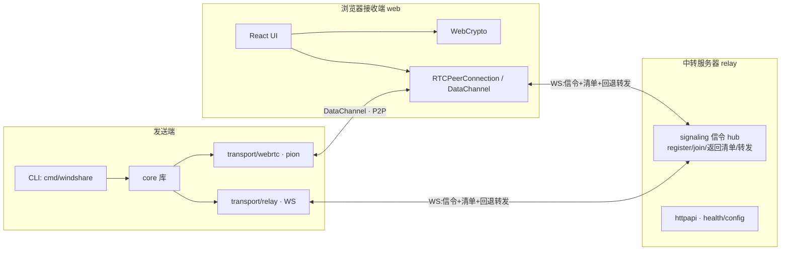

# WindShare 执行计划 v1

> 状态:**M1(M0/M1a/M1b/M1c)已完成并通过独立复审;G-EXT 已解决(2026-07-13,`core/v0.1.1` 首发于 `github.com/WindShare/windshare`)**。实际状态、实测浏览器矩阵与性能基线见 [§11 M1 实际状态](#11-m1-任务分解wbs);验收证据均在 `docs/.orchestration/`。
> v1.1(决策锁定):GitHub 组织 **WindShare**、模块路径 `github.com/windshare/windshare`(核心子模块 `…/core`)、`DefaultChunkSize = 1 MiB`、**随机 nonce 方案确认采纳**。详见 [§10.2](#102-已确认项)。
> v1.2(评审订正):GCM 生日界改按 **Seal 次数**计并加 `MaxSealsPerSegKey` 熔断;威胁模型补"持链者可伪造"残余风险与 REQUEST 访问模式泄漏;清单 CBOR 采 **fxamacker/cbor**;非 FSA 浏览器多文件降级 = **流式 ZIP**;补中转每会话背压、Windows 路径细则(`:`/ADS、MAX_PATH、reparse point)、续传 journal、sessionId 分配、小分享直下策略(`SmallShareBytes`)。
> v1.3(威胁模型订正):"链接经群聊等半公开渠道流转"升为一等假设 → "中转拿不到链接"不可依赖;残余风险补第二攻击变体(**单独恶意持链者对诚实中转的 shareId 劫持**);**签名套件 suite `0x02` 自 M5+ 提前至 M2**,设计预案钉死于 [§6.14](#614-签名套件-suite-0x02m2设计预案)(仅签清单不够,须逐块签名);M1b 增"起传需用户手势";M2 增 `--relay-only`;密码档列 M3;M4 `expiresAt` 入签名清单。
> v1.4(分离密钥):新增**可选**"分离密钥(split-key)"操作,**默认仍为单条完整链接**——发送者可选择去掉 fragment、密钥经另一渠道发送;网页 fragment 为空时出密钥输入框(M1b),CLI `share --split-key` / `get --key`(M1a)。128-bit 随机密钥免疫离线爆破,已覆盖密码档主要价值 → 密码档 suite 降为 **M3 可选**(独特价值仅剩口令可口述/可记忆)。
> v1.5(评审订正):WebRTC 信令/ICE 一并纳入用户手势门禁(防机器人自动触发 ICE 收割发送端 IP);sealedManifest **每分享仅 Seal 一次**、字节复用(清单指纹稳定);发送端断线宽限 `SenderReconnectGrace` + 接收端 rejoin 续传;信令帧优先于转发数据面(防热切换被队头阻塞);前端 fragment 读毕 `history.replaceState` 抹除(防进浏览器历史/云同步);`.wsresume` 列保留名;mtime 钉死 Unix 毫秒;`?r=` 按多值设计;M5 补滥用处置与 egress 成本;WBS 补 `core/share` 门面。
> v1.6(评审订正):钉死**双模块发版机制**(根模块禁 `replace`、core 先行打 tag、pseudo-version 起步、CI 加 `GOWORK=off` 构建校验,§6.2);依赖口径改"**直接依赖**三项"(`fxamacker/cbor` 传递携带 `x448/float16`);拆分理由照实改为审计与重实现边界(实际嵌入物为 engine+模块②);新增 **`relay/protocol`** 共享线协议类型包;中转二进制更名 **`cmd/wsrelay`**(避免与 `transport/relay` 及二进制名 `relay` 混淆);`adapter/osfs` 更名 **`core/osfs`**(按能力命名,去层名目录);覆盖率**按 Go 模块分别计**;跨实现对拍以**仓库 checkout** 为准(core 模块 zip 不含 `testvectors/`)。
> v1.7(评审订正):**依赖策略去教条化**——"极简依赖 / stdlib-only"不作为目标,依赖取舍只看合理性(确有需要、质量可靠);删除"禁止引入外部依赖""依赖钉死 N 项""依赖白名单"等硬性表述,`[stdlib-only]` 降为现状描述;§9 删"引入依赖"风险行(引入依赖本身不是风险);拆模块理由收敛为"网络重依赖不进加密核心(可审计、可重实现)"。
> v1.8(扩展预案):shareId 入 **WS URL 路径**(`/ws/<shareId>`,M1 前向要求,§6.7),为区域内 L7 按 shareId 一致性哈希分流留位;新增 [§6.15](#615-多中转扩展m5设计预案) **多中转扩展(M5,设计预案)**——链接即路由、节点零共享:发送端就近注册且 `?r=` 钉死具体节点、接收端多值并行赛跑、区域内一致性哈希、drain 零停机、P2P 成功率为容量第一指标。
> v1.9(Codex 评审订正):① 清单**删 offset/streamLen 派生字段**——数组顺序即流顺序(GCM tag 认证),双端各自对 size 前缀和推导,"几何不一致"攻击面(重叠/越界 offset、稀疏文件撑盘)整类消失;接收端补 size 非负 + 路径折叠碰撞校验(§6.4/§6.5/§6.13,B14)。② 块密文 **Seal-once 字节复用**(重放同字节为密码学空操作),订正 §10.2.3"密文缓存需确定性 nonce"的错误因果与 §6.14 同款措辞,为 M5 中转密文缓存留门(§6.3)。③ 调度器**有序交付模式**(流式 ZIP/StreamSaver 需按序出字节:有界重排缓冲 + 队头重试最高优先,§6.6/§6.10)。④ **线协议版本位**:WS 端点 `/v1/ws/<shareId>`,config 通告协议版本(§6.7)。⑤ 断线宽限防抢注改 **resumeToken 哈希/原像**(字节一致降为纵深——join 可得清单字节、持 readSecret 者能 Seal 合法伪块,原检查为名义防护,§6.8)。⑥ 清单超限:出链接前序列化预检报错、中转加清单内存预算 `MaxTotalManifestBytes`、百万级条目留 M5 分片清单(§6.9/§8/§9)。
> v1.10(M1 契约收敛):几何界改为 `1KiB..4MiB`/`2²⁶` 块/`2⁴⁸` 字节并以 `ChunkSet` 保持需求紧凑;selection 统一为 `TransferPlan` + `PlanID`,journal v2 绑定选择与精确 ownership;路径策略钉死 Unicode 15 full fold + `os.Root`;`FrameChannel.SendTerminal` 与 relay `0x03` terminal-forward、per-session lanes/tombstones 成为线协议不变量;新增共享 geometry/path/plan/relay 向量。
> v1.11(M1 收官状态收敛):§5/§11 记录 M0–M1c 实际完成状态、实测浏览器矩阵与性能基线;§6.2 架构树补 `relay/admission`、`connectivity` 编排层(Go + web)与 `e2e/`/`spikes/`;8 MiB/10 s 连接策略常量归属改为接收端编排层(`web/src/connectivity`,合同 11,已自 `core/session` 移除);§7 对齐已验收 CI 契约(E1);`Sink` 接口示例补 `DeliveryOrder`;清理过时接口表述。
> 配套文档:[`原始需求.md`](../原始需求.md)(产品愿景)、[`AGENTS.md`](../AGENTS.md)(工程规约)。
> 本文为唯一权威、自包含;所有实现以本文的最终规范、任务分解与验收门为准。

---

## 目录

- [0. 设计取舍](#0-设计取舍)
- [1. 项目概述](#1-项目概述)
- [2. 设计原则与威胁模型](#2-设计原则与威胁模型)
- [3. 总体架构](#3-总体架构)
- [4. 已锁定的关键决策](#4-已锁定的关键决策)
- [5. 里程碑路线图](#5-里程碑路线图)
- [6. MVP-1 详细设计](#6-mvp-1-详细设计)
- [7. 测试策略(≥70% 覆盖)](#7-测试策略70-覆盖)
- [8. 关键常量](#8-关键常量)
- [9. 风险与缓解](#9-风险与缓解)
- [10. 待评审的未决项](#10-待评审的未决项)
- [11. M1 任务分解(WBS)](#11-m1-任务分解wbs)
- [附录 A:术语表](#附录-a术语表)
- [附录 B:core 加密落地 checklist(自包含)](#附录-bcore-加密落地-checklist自包含)

---

## 0. 设计取舍

| 决策域 | 采用 | 理由 |
|---|---|---|
| 范围 / 里程碑 / WBS | 整个 MVP-1,M0→M1a/b/c | 先把 CLI 发送、网页接收、中转/信令、P2P 热切换拆成可独立验收的阶段,降低整系统集成风险 |
| 传输抽象 | `FrameChannel`(搬帧)+ 调度器(块协议) | 直击产品最难点:P2P/中转热切换、双路聚合只需在调度器增减通道 |
| 序列化 | 清单 = 确定性 CBOR;数据面 = 定长二进制;信令 = JSON(清单 blob 走二进制帧) | JSON+DEFLATE 有 JS float64 精度坑 + DEFLATE 跨版本不确定;CBOR 可逐字节对拍 |
| 路径安全 | NFC + Windows 保留名 + 大小写碰撞检测 + 落盘校验 | 跨平台(Win/mac/iOS)落盘必需;M1 即处理可避免后续数据模型返工 |
| 中转 / 信令 / 连接三层模型 | 应用层加密字节转发、清单走 WS、无 HTTP 清单端点 | 零知识中转 + 单一获取路径,安全边界更干净 |
| 加密核心模块边界 | `link`/`layout`/`manifest`/`chunk`/`session`/`keyderiv`/`osfs` | 深模块、纯函数优先、接收接口返回结构体,便于 TDD 与跨端复用 |
| 内容模型 | **打包流**(跨文件统一分块,全局块号) | 同时优雅处理大文件与海量小文件;清单无逐块数组,体积小一个量级 |
| 完整性 | 每块 GCM tag + AAD=块号 + 清单根 MAC + 同源密钥绑定;**无逐块哈希** | AEAD 已逐块认证,逐块哈希冗余;且哈希会**逼迫预读全部内容** |
| 出链接瞬时性 | 只 `stat`(名/大小/mtime),**不读内容、不算哈希** | 守住产品头号卖点"出链接近乎瞬时";逐块 sha256 会破坏它 |
| 链接能力 | 128-bit `readSecret` + `suiteByte` 自描述套件位 | 链接更短(fragment ≈ 23 字符);套件位天然支撑未来密码/256-bit 档 |
| **nonce 策略** | **每块随机 12B nonce、随密文上线;AAD=块号 做位置绑定;分段轮换子密钥 + Seal 计数熔断兜 GCM 生日界** | 同时解决"漂移灾难"与"瞬时出链接",不把安全性绑定到预读哈希 |

### 三处关键设计订正

**① nonce:确定性 → 随机**
确定性 nonce(= 块号)的隐患是:分享期间源文件被改、某块以**同 `(key, nonce)` 重新加密不同明文** → GCM nonce 复用灾难(可恢复认证子密钥、泄露明文异或、伪造)。常见补丁要么只做 `size+mtime` 弱检测,要么做逐块 sha256 强检测;但 sha256 **必须预读全部内容**,直接破坏"瞬时出链接"。
**根因在 nonce 策略本身。** 改为**每块独立随机 nonce**:
- 漂移再也不会造成 nonce 复用(每次加密都是全新 nonce)→ 从"密钥泄露级灾难"**降级**为"极小概率的内容不一致";
- 位置绑定从"nonce 编码位置"改由 **AAD = `u64_be(全局块号)`** 承担(等价,且更显式);
- 代价仅 **12B/块**(1 MiB 块下 ≈ 0.001%),且无需逐块哈希、无需预读 → **瞬时出链接与漂移安全同时拿到**;
- "密文可复现"不再是不变量,但**字节可复用**:块与清单均可 Seal-once 缓存复用(§6.3);金标向量用注入固定随机源保持确定性(与两边注入 `readSecret` 同法)。
- `size+mtime` 检测保留,但**降格**为"一致性兜底"(变更即中止,避免接收端拿到前后拼接的文件),不再承担安全关键职责。

**② 删除清单里的逐块 sha256**
完整性由四者组合保证,无需逐块哈希:每块 GCM tag(内容真实)+ AAD=块号(位置绑定)+ 清单根 MAC(几何/布局认证)+ 同源密钥绑定(跨分享拼接失败)。详见 [§6.5](#65-完整性论证为何无需逐块哈希)。

**③ NFC 规范化:M1 必做**
"零外部依赖"很有吸引力,但本工具目标含 mac/iOS(NFD 倾向)与 Windows,跨平台落盘的路径折叠是真实正确性问题。决定:**引入 `golang.org/x/text`,但仅限 `manifest`(构建期规范化)与 `osfs`(落盘校验)边缘**;纯加密包(`link`/`chunk`/`keyderiv`/`layout`)当前用不到外部依赖,深模块边界不被污染。

---

## 1. 项目概述

**WindShare** 是文件/文件夹即时分享工具。核心价值:**选中文件 → 一键出链接(近乎瞬时)→ 对方浏览器打开即下载**,内容**端到端加密**,**本地不预上传、不预读、不预哈希**(发送端在线时按需直传),中转对文件名/大小/内容尽量"零知识"。

- 接收端主力是**浏览器**(官方前端 `windshare.top` + WebRTC + WebCrypto),亦提供原生 CLI 接收。
- 传输**优先 P2P**(浏览器 ↔ 发送端 WebRTC DataChannel);P2P 协商失败回退到**中转加密字节转发**,P2P 后台连上后**热切换**剩余块(或双路聚合带宽)。
- 链接形如 `https://windshare.top/<shareId>?r=<中转>#<能力令牌>`;`#` 后是**能力凭证**,浏览器永不发往服务器。
- 全开源(**Apache-2.0**),中转人人可部署;客户端可配置多个中转地址。

> 本质模型:**能力链接(capability URL)+ 发送端在线直传 + 中转零知识回退**。"双方不同时在线时临时寄存"属后续里程碑(M4),非 MVP-1 范围。
> **不可让渡的产品约束**:出链接只做一次元数据遍历(`stat`),**绝不读内容、绝不算哈希**——海量文件 / 超大文件都要秒级出链接。本文所有加密设计均服从此约束。

---

## 2. 设计原则与威胁模型

### 2.1 工程原则(继承 `AGENTS.md`)

- **深模块 / 关注点分离**:`core` 暴露窄接口,内部封住加密、分块、传输、调度的复杂度。
- **面向可测试性(DfT)**:依赖注入 + 消费侧定义接口 + 小而纯的函数;传输层全部接口化以便 mock。
- **接收接口,返回结构体**:接口在使用方(调度器/门面)定义,实现方返回具体结构体。
- **避免硬编码**:魔法数/字符串提取为具名常量(见 [§8](#8-关键常量))。
- **无向后兼容包袱**:pre-v1.0,优先按领域语义重构核心结构,而非追加兼容旗标。
- **注释解释"为什么"**:设计取舍、密码学约束、协议不变量必须有 Why 注释。

### 2.2 威胁模型(档位:防恶意中转)

| 角色 | 信任假设 | 能看到什么 |
|---|---|---|
| 中转(官方/第三方) | **不可信**(诚实好奇 / 可能恶意) | `shareId`、密文帧、密文总字节数(≈大小)、连接时序、IP |
| 前端(官方/自部署) | **由使用者自行选择并信任**(持有解密密钥,理论上可魔改窃密钥) | 全部明文——故密钥只交给接收者亲自选定的前端;官方前端开源可自部署、可审计 |
| 持链接者 | **被授权**(链接即能力) | 全部内容(链接可多人复用,符合产品预期) |
| 发送端(清单提供方) | **不可信于接收端落盘** | 接收端不信任清单路径,落盘前自行校验(防穿越,见 [§6.13](#613-路径安全与跨平台规范化m1-必做)) |
| 网络中间人 | 不可信 | P2P 由 DTLS 加密;中转回退由应用层 AEAD 加密;均无明文 |

**保护目标**:中转拿不到密钥、文件名、文件内容;接收端不被恶意路径穿越。
**已知泄漏(MVP-1 接受)**:中转可见密文总字节数≈总大小、时序、`shareId`、IP、**回退转发时明文 `REQUEST` 帧里的块号(访问模式)**。彻底隐藏需 padding / 请求加密,列为后续可选。
**流转假设(一等公民)**:链接预期经**群聊等半公开渠道**流转。推论:① 聊天平台服务器可见完整链接——fragment 是消息文本的一部分,"不发往服务器"只约束 web/中转;平台在密码学上**等价于持链者**。敏感内容的对策 = **分离密钥(可选操作,默认单链,§6.10)**:密钥不落单渠道,且 128-bit 随机密钥**免疫离线爆破**(对比:密码档下任何持 shareId 者可拉 sealedManifest 离线爆破弱口令,故须 Argon2id 硬扛;密码档因此降为 M3 可选,独特价值仅剩口令可口述);② 持链者集合不可控扩大(转发/截图),**"中转拿不到链接"的前提系统性弱化**;③ 链接预览/杀毒扫描机器人会自动访问链接 → 页面起传**与 WebRTC 信令/ICE** 均需用户手势(§6.10)。
**残余风险(MVP-1 文档化接受,M2 修复)**:完整性全部建立在 `readSecret` 派生的**对称**密钥上,而每个持链者都持有 `readSecret`——"接收端能验 = 接收端能造"。两个攻击变体:
- **合谋伪造**:持有链接的中转(或与持链者合谋的中转)可伪造通过全部四层校验的清单与块,对其他诚实接收端**无痕替换内容**。P2P 不救:DTLS 指纹经中转信令交换,持链中转可自扮发送端完成握手与供块。
- **shareId 劫持(前提更弱,无需恶意中转)**:M1 无 `writeSecret` 所有权证明,且 shareId 会话随发送端断开而回收(§6.8)→ 任意持链者可在发送端下线后(或注册竞态中)向**诚实**中转 register 同一 `shareId`,以伪造内容"复活"链接;后点开旧链接者全中,校验全过。宽限窗内的抢注 M1 即由 `resumeToken` 封堵(§6.8);本残余指**期满回收后**的复活与首注册竞态。

结构性修复 = **签名套件 suite `0x02`(M2,§6.14)**:非对称签名打断"能验即能造",两个变体同死,且中转零改动。**仅签清单不够**——清单无逐块哈希(D9),不签块则攻击者仍可在真实几何内替换内容;逐块签名见 §6.14。
**安全关键不变量**:① 链接中除 `readSecret` 外皆非秘密;② `readSecret` 永不离开浏览器/host;③ **每块加密用全新随机 nonce**,单 `segKey` 的 Seal 次数由 `MaxSealsPerSegKey` 熔断封顶,nonce 碰撞概率 ≤ 2⁻³²(见 [§6.3](#63-加密与链接设计核心))。
**非目标(MVP-1)**:前向保密(PFS)、抗流量分析、抗恶意持链者**读取/再分发**(链接本就是授权凭证;其**伪造**属上述残余风险,M2 修复)、供应链(以可复现构建 + SRI 另行应对)。

---

## 3. 总体架构



**核心洞见(贯穿全设计)**:**数据面消息(`REQUEST`/`BLOCK`)与传输层解耦**——传输层只是一条搬帧的 `FrameChannel`(DataChannel 或 relay WS 各实现一个);**块协议(请求/重组/重排/背压/重试/源评分)只在调度器里实现一次**。"先中转传、后台连 P2P、连上热切换""双路并行聚合"复用同一套调度代码。

**第二洞见**:**加密核心与传输无关**——它只产出"加密块 + 加密清单 + 链接",谁来搬、怎么搬一概不关心。`core` 不含任何网络/磁盘副作用入口,IO 全部经接口注入。

> 清单获取**只走一条路径**:WS `join` 返回加密清单。HTTP 仅 health/config;静态前端由站点/CDN 托管,与中转 API 分离,避免两套获取路径各自的 CORS/Origin 安全边界。

---

## 4. 已锁定的关键决策

| # | 决策 | 选择 |
|---|---|---|
| D1 | 首期范围 | CLI 发送 + 网页接收 + 中转/信令(暂不做 GUI),拆 M1a/b/c 增量交付 |
| D2 | 技术栈 | Go 统一核心库 + Flutter UI(后续)+ React/TS 网页端;MVP-1 用 CLI 驱动核心 |
| D3 | 分发模型 | 单源、不做种;"多连接" = P2P+中转双路热切换/聚合,非 swarm |
| D4 | 中转回退 | 应用层加密字节转发(WS,不跑 TURN);NAT 穿透用公共 STUN |
| D5 | 许可证 | Apache-2.0 |
| D6 | 传输抽象 | `FrameChannel`(搬帧)+ 调度器(块协议)分层 |
| D7 | 序列化 | 清单 = 确定性 CBOR、数据面 = 定长二进制、信令 = JSON(仅控制字段;清单 blob 走二进制 WS 帧,§6.7) |
| D8 | 内容模型 | **打包流**:文件按规范序拼成一条逻辑流,统一分块,**块可跨文件**,全局块号寻址 |
| D9 | 完整性 | 每块 GCM tag + **AAD=块号** + 清单根 MAC + 同源密钥绑定;**无逐块哈希、无 Merkle** |
| D10 | **nonce** | **每块随机 12B nonce,随密文上线;分段(16 GiB)轮换子密钥 + Seal 计数熔断兜 GCM 生日界** |
| D11 | 出链接 | 只 `stat`、不读内容、不算哈希 → 瞬时;漂移用 `size+mtime` 检测一致性,变更即中止 |
| D12 | 链接能力 | 128-bit `readSecret` + `suiteByte` 自描述套件位;纯 bearer 读链接 |
| D13 | `shareId` | 客户端生成 72-bit 随机路由句柄,**不入密钥**;中转遇活跃碰撞则要求重生成 |
| D14 | 清单获取 | 统一走 WS `join` 返回加密清单,无 HTTP 清单端点 |
| D15 | 路径安全 | 清单 canonical(含 NFC)+ 接收端落盘校验 + Windows 保留名/碰撞拒绝;NFC 采 `golang.org/x/text`,仅限 IO 边缘 |
| D16 | Flutter 桥接(M2+) | FFI 仅引导进程内 engine(导出 `Start/Stop`;`Start` 返回 loopback 随机端口 + 每次启动随机 token,不落盘)+ 本地 WS 控制面 RPC(JSON,请求/响应带 id + 事件推送,进度节流);**数据面不过桥**。五端共享同一 Dart RPC 客户端,仅 bootstrap 分平台(桌面 c-shared,移动 gomobile);不做 sidecar 子进程(iOS 禁止) |
| D17 | 流转与真实性 | 链接按**群聊等半公开渠道流转**建模(§2.2);真实性以**签名套件 suite `0x02` 在 M2 修复**(§6.14),M1 仅 `0x01` + 文档化接受;保密性对抗平台 = **分离密钥(可选操作,默认单链,M1,§6.10)**,密码档降 M3 可选 |

---

## 5. 里程碑路线图

| 里程碑 | 目标 | 关键交付物 |
|---|---|---|
| **M0** 地基 ✅ | 仓库骨架 + CI + 跨实现测试向量 + WebRTC 风险 spike | monorepo、`LICENSE`/`NOTICE`、CI(覆盖率门禁)、Go↔TS 黄金向量框架、协议规范初稿、pion↔浏览器抛弃式连通 spike |
| **M1a** 核心管线 ✅ | CLI↔CLI 经中转跑通 | `core`(crypto/layout/manifest/chunk/session)、`relay`、`transport/relay`、CLI `share`/`get`、选择性下载、断点续传、路径安全 |
| **M1b** 浏览器接收 ✅ | 浏览器经中转接收 | `web`(crypto/manifest/transport/React UI)、文件树勾选、落盘(路径校验)、浏览器 E2E |
| **M1c** P2P 与并发 ✅ | P2P 直连 + 热切换 + 并发 | `transport/webrtc`、`connectivity`(Go + web)、10s 赛跑 + 热切换、并发多接收端验证、性能基线 |
| **M2** 桌面 GUI + 签名套件 | Windows 优先完整桌面体验;真实性结构修复 | Flutter 桌面 UI、右键"分享"shell 集成、多中转配置、`engine` 控制面(FFI 引导 + loopback WS RPC,D16)、**签名套件 suite `0x02`(§6.14)**、`--relay-only` 隐私开关(不做 ICE,防发送端 IP 暴露给持链者) |
| **M3** 移动端 | Android/iOS | Flutter 移动 UI、系统分享面板、iOS 后台限制处理、密码档 suite(**可选,再评估**:分离密钥已覆盖其主要价值且免疫离线爆破,独特价值仅剩口令可口述/可记忆;Argon2id) |
| **M4** 离线模式 | 双方不同时在线 | 中转临时寄存、账户/API Key、配额与保留策略、`writeSecret` 实装(所有权证明)、链接生命周期控制(过期 / 撤销 / 下载次数上限;**`expiresAt` 入签名清单**,封 §6.14"原样复活"残余) |
| **M5** 加固与上线 | 生产可用 | 多 PeerConnection/**多中转并行与全球扩展(§6.15 预案)**、可选 padding、可选逐块哈希(无密钥 swarm/去重时)、分片清单(百万级条目,§9)、`windshare.top` 公网部署、**滥用处置(举报→禁用 shareId、速率/配额、ToS)与中转 egress 成本核算** |

> 本文详述 **M1(a/b/c)**;M0 为前置任务。三个子阶段各有独立验收门(见 [§11](#11-m1-任务分解wbs))。✅ = 已完成并通过独立复审(2026-07-13);逐门验收证据见 §11。

---

## 6. MVP-1 详细设计

### 6.1 范围与交付物

**做**:单源分享完整闭环——CLI 发送、网页/CLI 接收、中转信令+回退、E2E 加密、**打包流统一分块**、**选择性下载**、**路径安全规范化**、断点续传、**P2P+中转双路与热切换**、**并发多接收端(单源扇出,M1c 验证 1–2 个)**、本地端到端测试、**Go↔TS 黄金向量逐字节对拍**。

**不做(留后续)**:GUI、桌面右键、移动端、离线寄存、账户、TURN、padding、swarm 做种、**逐块哈希/Merkle**、公网部署、传输前压缩、**多 PeerConnection/多中转真正并行**、并发规模压测与每接收端限速。

### 6.2 仓库结构(monorepo)

```
windshare/                         # 仓库 github.com/windshare/windshare(组织 WindShare;GitHub 大小写不敏感,模块路径取小写惯例)
  go.work                          # use ./ 与 ./core,绑定下面两个模块
  LICENSE / NOTICE                 # Apache-2.0
  core/                            # 模块① —— github.com/windshare/windshare/core
    go.mod                         #   当前直接依赖:stdlib + golang.org/x/text + fxamacker/cbor(传递携带 x448/float16)
    link/                          # 能力链接解析/构造(suiteByte ‖ readSecret + shareId + relay)  [stdlib-only]
    layout/                        # 打包流布局:规范序、offset 前缀和、块↔range 双向映射(纯算术)  [stdlib-only]
    chunk/                         # AEAD 分块:段子密钥、随机 nonce、AAD=块号、Seal/Open(纯)        [stdlib-only]
    internal/keyderiv/             # HKDF 派生(manifestKey/streamKey/segKey),对外不可见            [stdlib-only]
    internal/testvec/              # 金标向量读取骨架(仅测试消费,§7;testvectors/ 在 core 模块 zip 之外)
    manifest/                      # 目录模型 + 确定性 CBOR + GCM 封装/解封 + 路径 canonical(NFC)     [x/text, fxamacker/cbor]
    share/                         # 门面 Sharer/Receiver(§6.6):组合 link/layout/chunk/manifest,IO 全注入
    session/                       # FrameChannel 接口 + 调度器(块协议) + 发送/接收会话(接口在此消费侧定义)
    osfs/                          # 真实 FS 的 Source/Sink + 遍历(根目录限制、NFC 校验、漂移检测)   [x/text]
  go.mod                           # 模块② —— github.com/windshare/windshare(CLI/传输/中转,重依赖;import 模块①)
  cmd/windshare/                   # CLI:`share <paths>` 出链接;`get <link>` 下载
  transport/
    relay/                         # FrameChannel over WS —— 实现 core/session 的接口(WS 客户端依赖)
    webrtc/                        # FrameChannel over pion DataChannel —— 实现 core/session 的接口(pion 依赖)
  connectivity/                    # 连接编排层(M1c):信令投影、WebRTC 协商、发送端扇出、指纹门禁的接收端恢复;策略在传输/会话之上(合同 11),适配器保持零策略
  engine/                          # (M2)控制面门面:core/session 之上的 loopback WS RPC;FFI 仅导出 Start/Stop(D16)
  relay/                           # 中转 + 信令服务器
    cmd/wsrelay/                   # main —— 自托管者 `go build ./relay/cmd/wsrelay`(二进制名 wsrelay,`relay` 太泛)
    protocol/                      # 信令 JSON 消息 + 转发帧 sessionId 包裹的共享类型(纯类型零依赖;transport/relay 与服务端共同 import)
    signaling/                     # 按 shareId 的 WS hub:register/join(返回清单)/SDP·ICE 转发
    forward/                       # 应用层加密字节转发(P2P 失败时的数据面);有意跨会话共享的转发泵 + per-session 有界 lanes(§6.8)
    admission/                     # 可注入的 lease 型资源准入:注册速率/并发分享/清单字节预算/join 与全局连接策略;lease 熬过重连宽限、实际回收才释放
    httpapi/                       # 仅 health/config + WS Origin 白名单
  e2e/                             # 真实二进制进程级 E2E(M1a)+ M1c 真实路径并发/终止漂移;分层权威 = docs/.orchestration/e2e-coverage-map.md
  spikes/webrtc/                   # T0.5 Pion↔Chromium 抛弃式 spike(结论与证据保留,docs/.orchestration/webrtc-spike.md)
  scripts/                         # Windows 固定路径运行器与网络策略回归(D5;Windows 上 Playwright 的唯一许可入口,§7)
  web/                             # 模块外:TS 网页接收端(windshare.top 前端):Vite + React + TS
    src/contracts/                 # 窄共享 TS 契约(链接/清单值、块选择、帧通道/终止交付、随机写 vs 有序 sink)
    src/crypto/                    # WebCrypto:HKDF / AES-256-GCM / 与 core/chunk 对齐黄金向量
    src/manifest/                  # 清单 CBOR 解析(与 core/manifest 对齐)+ 路径策略/几何界/TransferPlan
    src/transport/                 # FrameChannel over WS / DataChannel
    src/session/                   # 调度器(与 Go 端同构)
    src/download/                  # 落盘能力与 sink:FSA 随机写 / 单文件流 / 流式 ZIP+Zip64(C3)
    src/connectivity/              # 浏览器连接策略:手势门禁后的 8 MiB/10 s 赛跑、热加入、聚合(D4;合同 11 的常量归属地)
    src/ui/                        # 接收界面(React:文件树勾选、进度)
    e2e/                           # Playwright 真实栈 E2E(真实 wsrelay + windshare CLI + Chromium)
  testvectors/                     # Go↔TS 共享黄金向量(crypto / 清单 CBOR / 数据面二进制)
  docs/                            # 协议规范、威胁模型(从本计划拆出)
```

> **拆两个模块的理由**:网络/传输类重依赖(pion、WS、HTTP)不进加密核心,使 `core` 保持**可审计、可被第三方重实现**;core 的依赖按需引入、合理即可,当前为 stdlib + `x/text` + `fxamacker/cbor`(均纯 Go;构建闭包另含 cbor 的传递依赖 `x448/float16`,`x/text` 声明的 `x/tools` 仅代码生成、不进构建;Go 标准库无 CBOR,手写 canonical 编解码的出错面大于引入一个成熟依赖)。注意 M2 起经 FFI/gomobile 实际嵌入 5 端的是 engine + 模块②整体——拆分收益在审计与重实现边界,不在嵌入体积。`transport/*` 在模块②**实现** `core/session` 定义的 `FrameChannel` 接口(Accept Interfaces / Return Structs:接口在 core 消费侧,pion/WS 实现留在外层)。core 永不 import transport。
> **双模块发版机制(嵌套模块,必须遵守)**:根模块以**版本** require `…/core`,**禁用 `replace`**(根模块含 replace 会令 `go install …/cmd/windshare@latest` 失败);M0 首次 push 后即以 core 的 pseudo-version 填 require。发版两步:先打 `core/vX.Y.Z` tag → 根 `go.mod` 升 require → 再打 `vX.Y.Z`。`go.work` 只服务本地开发;`go mod tidy` 与发布构建不认 workspace,根 `go.sum` 须对 core 完整——CI 以 `GOWORK=off` 跑一遍构建守住该不变量(入 T0.2)。
> 包命名遵循"按提供的能力命名",杜绝 `util/common/misc`。`[stdlib-only]` 是**现状描述**(这些包当前用不到外部依赖),不是禁令——任何包需要新依赖时,以合理性论证(确有需要、质量可靠)引入即可;当前 `x/text` 仅出现在 `manifest`/`osfs`,`fxamacker/cbor` 仅出现在 `manifest`(编码取 Core Deterministic 选项,解码取严格模式、拒非 canonical 输入;TS 侧配 `cbor-x` 或手写解码,金标向量逐字节钉死双端)。

### 6.3 加密与链接设计(核心)

**链接格式**

```
https://<前端域>/<shareId>?r=<中转主机>#<base64url(suiteByte ‖ readSecret)>
                 │           │             └── fragment,浏览器不发送(能力令牌)
                 │           └── 可选:第三方中转提示(非秘密,明文);缺省 = 同源/官方中转
                 └── 路径 = shareId,发给中转(定位会话)
```

- `readSecret`:**16B / 128-bit** 随机(`crypto/rand`)。fragment = `suiteByte(1) ‖ readSecret(16)` → base64url 无填充 ≈ **23 字符**。
- `suiteByte`:套件/版本位。`0x01` = {AES-256-GCM, HKDF-SHA256, 128-bit readSecret, 随机 nonce}。**签名档 `0x02` 预案见 §6.14(M2)**;"密码档(Argon2,M3)""256-bit 档""ChaCha 档"皆为新 suite 号。
- `shareId`:**9B / 72-bit** 客户端随机,base64url,**纯路由句柄,不进任何密钥派生**。中转据此定位会话;活跃碰撞(astronomically rare)时中转拒绝、客户端重生成。
- `?r=` **按多值设计**(`?r=a&r=b`,发送端向多中转注册、接收端按序尝试):M1 仅实现单值,但解析自始按列表处理,免 M5 多中转时改链接格式(原始需求点名"可配置多个中转")。
- **域名**:`windshare.top` **尚未注册**,前端域为部署期配置;MVP-1 用 `localhost`/可配置 base URL。**建议尽早注册**。

**密钥派生(HKDF-SHA256,salt 一律为空,label 取精确 ASCII 字面字节、无结尾 NUL)**

```
manifestKey = HKDF(readSecret,            "windshare/v1 manifest", 32)
streamKey   = HKDF(readSecret,            "windshare/v1 stream",   32)
segKey(s)   = HKDF(streamKey, "windshare/v1 seg" ‖ u32_be(s),      32)
```

> `readSecret` 是唯一秘密;keys 的每分享唯一性由 `readSecret` 随机唯一保证,**故 salt 留空**;`shareId` 不入密钥。**读写分离**:host 另持一个独立、绝不进链接的 `writeSecret`(M1 仅占位,M4 离线寄存时用于向中转证明所有权),接收端因此无法伪造 host。

**AEAD 统一不变量**

> **每一次 GCM 加密都用一枚全新随机 12B nonce,并把 nonce 前置到密文一起上线。** AAD 编码"域 + 位置"。统一规则消除了一切"确定性 nonce 复用"的可能。

- **清单(manifest)**:`out = nonce(12, 随机) ‖ AES-256-GCM-Seal(manifestKey, nonce, CBOR(manifest), aad=suiteByte)`。manifestKey 每分享唯一 + 随机 nonce → 双重保险。**每分享仅 Seal 一次**,进程生命周期内复用同一字节串(断线重注册、多中转注册均复用)——GCM tag 即清单指纹,续传 journal(§6.12)与 suite `0x02` 的 manifestTag(§6.14)都锚定它,重 Seal 会令指纹漂移、续传失配。
- **块 i(block)**:
  ```
  seg      = i / chunksPerSeg          // chunksPerSeg = SEGMENT_BYTES / chunkSize
  nonce    = 12 随机字节               // 每次 Seal 重新生成
  aad      = suiteByte ‖ u64_be(i)     // 域分隔 + 全局块号(位置绑定)
  blockCT  = nonce ‖ AES-256-GCM-Seal(segKey(seg), nonce, plaintext_i, aad)
                                       // 块密文 = 12B nonce + 明文 + 16B tag
  ```
  线传输时把 `blockCT` 整体按 `MaxBlockPayload` 切帧,nonce 自然位于首帧——**数据面帧布局无需新增 nonce 字段**(见 [§6.7](#67-线协议信令面--数据面))。

**为什么随机 nonce + 分段轮换 + Seal 计数是安全的**

- 随机 96-bit nonce 的生日界:单密钥下 **Seal `n` 次**,碰撞概率 ≈ `n²/2⁹⁶`。**计的是 Seal 调用次数,不是块位置数**——不复用缓存时,每次块被请求都以新 nonce 重加密(多接收端扇出、重试、续传重发都在累加),分段只封顶位置数(`SEGMENT_BYTES/chunkSize` = 2¹⁴),封不住 Seal 次数。
- 因此每 `segKey` 维护 **Seal 计数器**,达到 `MaxSealsPerSegKey = 2³²`(NIST SP 800-38D 随机 IV 上限)即中止分享,碰撞概率封顶 ≈ `2⁶⁴/2⁹⁶ = 2⁻³²`。此界深不可及——相当于同一 16 GiB 段被完整重发 **2¹⁸ ≈ 26 万次**;熔断只为把不变量做成代码而非注释。
- **块密文允许 Seal-once 字节复用**(与清单同理):重放同一 `nonce ‖ ct ‖ tag` 是密码学空操作——nonce 复用灾难只发生在同 nonce 加密**不同**明文;缓存逐出后以新随机 nonce 重 Seal 同样安全。发送端可按块缓存首个 Seal 输出、跨接收端/重传复用(M1 不要求实现缓存);复用后 Seal 次数 ≈ 块数,熔断退化为纯不变量,且字节稳定为 M5 中转按 `(shareId, index, manifestTag)` 缓存热门分享密文留门(§10.2.3)。
- ≤16 GiB 的分享只有 1 段,退化为"单 streamKey",零额外复杂度。寻址始终用全局块号 `i`,分段纯属内部加密细节,传输层无感。
- 开销:每块 12B(nonce)+ 16B(tag);1 MiB 块下合计 ≈ 0.0027%。小文件已并入共享块,无"每小文件一份开销"的浪费。

> **漂移处理**:随机 nonce 已使"分享期间文件被改"在密码学上**安全**(不可能 nonce 复用);`osfs.Source` 在按需**读后复核** `size`/`mtime`(读→复核→交付,消除检查与使用之间的空窗),变更即中止("文件已变更,请重新分享"),负责**一致性**(避免接收端拿到改动前后拼接的文件)。残余(同 size 同 mtime 的原地改)最坏只是接收端内容不一致,非安全事件——M1 接受,M5 可加可选逐块哈希兜一致性。

### 6.4 内容模型:打包流(packed stream)

一个文件夹本质是"许多文件的有序集合";建模为一条逻辑字节流(如分块加密的 tar):

- **规范序**:对所有条目按**规范化相对 path**(`/` 分隔、Unicode **NFC**)的 **UTF-8 字节序**排序。
- **几何全派生,不入清单**:offset/streamLen **不是清单字段**——双端各自按 entries **数组顺序**对 size 做前缀和(仅文件参与,目录不占流):`offset[0]=0;offset[k]=offset[k-1]+size[k-1]`,`streamLen` = size 之和。数组顺序即流顺序,由清单 GCM tag 认证;派生量无从伪造,"几何不一致"(重叠/越界 offset、稀疏文件撑爆磁盘)整类攻击面不存在,也无需校验代码。
- **逻辑拼接,不物理重打包**:实际字节**传输时按需读**(host 用推导出的 offset 表把"块号"反查到"哪几个文件的哪段",即 `layout.ChunkToRanges`)。
- **块几何**:块 `i` 覆盖明文 `[i·chunkSize, min((i+1)·chunkSize, streamLen))`,共 `N=⌈streamLen/chunkSize⌉` 块,末块可短;`chunkSize` 须为 2 的幂。
- **资源几何是协议,不是实现建议**:`1 KiB ≤ chunkSize ≤ 4 MiB`、`N ≤ 2²⁶`、
  一位/块的稠密状态 `≤8 MiB`、`streamLen ≤ MaxStreamBytes = 2⁴⁸`(256 TiB)。
  双端用商/余数推导 `N`,并在分配 bitfield、请求状态、重组/块缓冲前拒绝越界。
- **需求保持紧凑**:`ChunkRange` 是半开 `[First,End)`,`ChunkSet` 是不可变、排序、
  互不相交且不相邻的规范区间集。完整分享表示为单区间 `[0,N)`,不得预展开为
  eager 块号 slice;union/subtract/iteration 均按区间工作。
- 出链接只需一次**元数据遍历**(`stat`:名/大小/mtime)→ **不读内容、不算哈希** → 海量/超大文件仍秒级出链接。
- **mtime 单位 = Unix epoch 毫秒(int64)**:快照、清单、漂移复核、`SetMTime` 统一此单位;毫秒在 JS 安全整数范围内(免 BigInt),对 FAT/exFAT 的 2 s 粒度亦无损。
- **条目不含 mode/执行位(M1 文档化接受)**:CLI↔CLI 在 mac/Linux 分享脚本/二进制目录时执行位丢失(浏览器端本无法 chmod);未来补 `mode` 属清单 schema 演进,按下条次序处理。
- **schema 演进次序**:解码**先宽容探测 `v`**——版本不识别 → 明确报错
  `manifest: unsupported manifest version; upgrade required`;版本已知才按对应 schema
  严格解码(B15)。否则旧接收端遇新清单只会抛不可读的 CBOR 结构错误。

**为何打包流而非"按文件对齐分块"**

| | 打包流 | 按文件对齐方案 |
|---|---|---|
| 海量小文件 | 并块摊薄 tag/开销,**清单仅一条/文件** | 每小文件 ≥1 块 + 一条块记录 → 清单膨胀 |
| 大文件 | 干净分块 | 干净分块(等价) |
| 清单体积 | **无逐块数组、无 offset/streamLen 字段**(几何由 size 前缀和推出) | 需逐块 size 数组(块不规则) |
| 选择性下载 | 选中文件覆盖的块区间;边界块可能与邻居共享(轻微过取,有 key 故无隐私问题) | 每文件整块,**零过取** |
| 调度器 | 全局块号(与按文件对齐**完全等价**) | 全局块号 |

打包流唯一让步是"选择性下载的边界块过取"(每个选中连续区间至多 2 个半块),换来清单体积小一个量级 + 小文件零浪费,且与调度器/全局块号模型**完全兼容**。

> **确定性**:规范序使布局确定可复现并带来目录局部性(选整个文件夹 = 连续块区间)。排序正确性**不承担安全职责**——接收端不验序,按清单数组顺序前缀和即得几何;规范序只为可复现/局部性/可测。

### 6.5 完整性论证(为何无需逐块哈希)

整体完整性由四者**组合**保证:

1. **每块 GCM tag** → 防篡改单块内容(密文改一字节即 Open 失败)。
2. **AAD = `u64_be(全局块号)`** → 位置绑定:块 `i` 的密文塞进 slot `j` 时,验证用 `aad=...‖u64_be(j)` 与封装时的 `i` 不符 → 换块/重排/反转/截断全部失败(随机 nonce 不再编码位置,**位置绑定由 AAD 承担**)。
3. **清单根 MAC**(清单的 GCM tag)→ 认证 `v`/`chunkSize`/`entries`(path/size/mtime)**及其数组顺序**,提交整份分享的布局;offset/streamLen 为派生量不入清单(§6.4),接收端据推导出的 `streamLen+chunkSize` 拒收缺块/多块,据推导 offset 表把块映射回文件。
4. **同源密钥绑定** → 清单与块均自同一 `readSecret` 派生;跨分享拼接因密钥不同而失败。

**为何不要 BitTorrent 式逐块哈希**:BT 无共享密钥、peer 不可信,只能靠哈希验块;而 WindShare 每个**合法接收端都持对称密钥**,AEAD 已逐块认证。逐块明文哈希在此**纯属冗余**,且会逼迫发送端在出链接前预读全部内容(违背瞬时出链接)。哈希仅在两个未来场景回归(由 suite 升级承载):向**无密钥公开 swarm** 取块;**跨分享去重**(按明文哈希寻址,牺牲跨分享隐私)。**M1 一律不引入 Merkle/逐块哈希。**

**接收端校验顺序(必须)**:重组块 `i` 全部帧 → 取首 12B 为 nonce → **AES-GCM 解密并验证 tag(AAD=suiteByte‖u64_be(i))** → 落盘前路径校验 → 流式落盘。(先解密认证,再落盘;无明文哈希步骤。)

### 6.6 核心库 `core/` 模块边界与接口

接口在**消费侧**定义,实现返回结构体。**传输与块协议分层**:`FrameChannel` 只负责可靠有序地搬帧、对"块"一无所知;块协议(请求队列、在途、超时、重排、源评分、帧重组、背压、重试)只在调度器实现一次。

```go
// ── 传输层:可靠有序的双向"帧通道"。WebRTC DataChannel 与 relay WS 各实现一个。
type FrameChannel interface {
    Send(ctx context.Context, f Frame) error  // 背压:缓冲满则阻塞/返回错误
    SendTerminal(ctx context.Context, f Frame) error // 接受即保证终止帧先于 Recv 关闭交付
    Recv() <-chan Frame                        // 入站帧流
    State() ChannelState                       // Connecting / Open / Closed —— 供热切换感知
    Close() error
}

// ── 发送端:按块读明文(消费侧 = 发送会话)。读后复核该块仍匹配快照(size/mtime),变更即中止。
type BlockStore interface {
    ReadBlock(index uint64) (plaintext []byte, err error)
    BlockCount() uint64
}

// ── 接收端:落地已解密、已校验的明文(消费侧 = 接收会话)。落盘前路径校验见 §6.13。
type Sink interface {
    WriteBlock(index uint64, plaintext []byte) error
    Have() Bitfield            // 已持有块,用于断点续传
    DeliveryOrder() DeliveryOrder // 交付顺序由 sink 自身声明(随机写 / 严格升序),组合方不得代记
}
```

**纯加密门面(位于 `core/share`;接口如下,按 §6.3 的随机 nonce/AAD 规范实现)**——`Sharer`/`Receiver` 把全部 IO 以接口注入,自身无副作用:

```go
type FileMeta struct{ Path string; Size, MTime int64; IsDir bool }

type FileSource interface { ReadRange(path string, off, n int64) ([]byte, error) }       // host 按需读
type FileSink   interface {                                                              // receiver 重建树/按段落盘
    EnsureDir(path string) error
    WriteRange(path string, off int64, data []byte) error
    SetMTime(path string, mtime int64) error
}

func NewSharer(files []FileMeta, src FileSource, opt Options) (*Sharer, error)
func (s *Sharer) Link() link.Link                   // 出链接(秒级,只 stat 过)
func (s *Sharer) SealedManifest() ([]byte, error)   // 交给中转的加密名片
func (s *Sharer) Chunk(i uint64) ([]byte, error)    // ReadRange → chunk.Seal(随机 nonce);块号统一 uint64,与数据面对齐
func (s *Sharer) NumChunks() uint64

func NewReceiver(l link.Link, sealedManifest []byte, dst FileSink) (*Receiver, error)
func (r *Receiver) Entries() []manifest.Entry
func (r *Receiver) Plan(selectors []string) (*TransferPlan, error)

func (p *TransferPlan) PlanID() PlanID
func (p *TransferPlan) SelectedEntries() []manifest.Entry
func (p *TransferPlan) SelectedBytes() int64
func (p *TransferPlan) Chunks() layout.ChunkSet
func (p *TransferPlan) Sink() *TransferSink
func (p *TransferPlan) Accept(i uint64, blockCT []byte) error
func (p *TransferPlan) Finalize() error
```

- **选择只解释一次**:`Receiver.Plan(nil)` 表示全选,非 nil 空 slice 表示空选;精确
  文件只选该文件,显式或隐式目录选子树,未知 selector 失败。`TransferPlan` 一并拥有
  selected entries/bytes、`ChunkSet`、plan-local have-state、只写选中 ranges 的 Sink
  与 finalization;receiver 级 `ChunksFor`/`Sink`/`Finalize(paths)` 不保留。
- **PlanID 钉住选择语义**:`SHA-256("windshare/v1 transfer-plan\x00" ‖
  repeated(u64_be(path UTF-8 byte length) ‖ path UTF-8 bytes))`,selected canonical paths
  按 UTF-8 字节排序。selector 顺序/重复不改变 ID;不同选择不得共用 have-state。
- **调度器独占数据面协议**:在一组 `FrameChannel`(P2P + relay 可并存)之上维护
  `TransferPlan.Chunks().Subtract(Have())`、每通道请求队列与在途块、超时/重试/重排、
  通道评分(吞吐/RTT)、帧→块重组、背压。
- **有序交付模式(流式 Sink)**:FSA 随机写不依赖顺序,但单文件流与流式 ZIP(§6.10)必须按流顺序出字节。有序约束由 `Sink.DeliveryOrder()` 声明并在会话构造期消费(应用组合无法覆盖或遗忘);调度器据此按块号升序消费需求集,维护有界重排缓冲(≤ 在途窗口 × 块大小),且**最小未交付块号的重试永远最高优先**——否则队头块丢失会堵死缓冲(队头阻塞换个地方复活)。
- **终止交付**:`ERROR` 是生命周期边界,只能经 `SendTerminal`;返回 nil 表示 transport
  已接受并保证它先于 close/`Recv` 关闭对端可见。普通 `Send(ERROR)` 后立即 `Close`
  不合规;交付失败须同时保留原始域错误与 `ErrTerminalDelivery`。
- **收尾物化**:size=0 的文件与空目录不占流、永无块到达——`TransferPlan.Finalize`
  只物化 selected entries;目录 `SetMTime` 在其全部子内容落盘后按**深度逆序**执行。
  完成条件 = plan 的所选块全通过**且**物化完成,journal(§6.12)其后才删除。
- **热切换**:后台新建的 `FrameChannel`(连上的 P2P)进入 `Open` 即加入池;调度器把后续块优先分给更优通道,旧通道降权或关闭;双路亦可同时用以聚合带宽。
- **发送端扇出**:每接收端一套独立会话与通道;`BlockStore`/`FileSource` 按需读盘(可共享读缓存,M1 可不做)。
- **纯函数优先**:块/帧数学、密钥派生、链接/CBOR/二进制编解码、路径规范化均为纯函数,直接单测;调度器对 mock `FrameChannel`(可注入丢帧/延迟/断连)单测。

> `Options` 携带 `chunkSize`、**可注入的固定 readSecret + 随机源**(用于确定性/测试)、`shareId`、未来开关。**随机源注入是金标向量确定性的命脉**——随机 nonce 在测试中由固定 RNG 喂出。

### 6.7 线协议(信令面 + 数据面)

**信令面**(经中转 WS,**JSON**;中转仅转发、不参与哈希):

| 方向 | 消息 | 说明 |
|---|---|---|
| 发送端→中转 | `register {shareId, resumeTokenHash}` + 清单二进制帧 | 注册分享并上传加密清单(blob 紧随 register 走二进制帧);`resumeTokenHash = SHA-256(resumeToken)`,断线宽限期重注册凭 token 原像(§6.8) |
| 发送端↔中转 | `keepalive` | 维持在线(`KeepaliveInterval`) |
| 接收端→中转 | `join {shareId}` | 加入分享;`not_found` 时短窗指数退避重试(join 先于 register 的竞态罕见但存在) |
| 中转→接收端 | `manifest {sessionId}` + 清单二进制帧 / `not_found` | **唯一**的清单获取路径(无 HTTP 端点);`sessionId` 由**中转**在 join 时分配、标识该接收会话,后续 `signal`/`bye`/转发帧均携带,随会话结束失效 |
| 双向(经中转转发) | `signal {sessionId, kind, payload}` | WebRTC 协商(offer/answer/candidate) |
| 双向 | `bye {sessionId}` | 结束会话 |

> **WS 端点路径 = `/v1/ws/<shareId>`(M1 前向要求)**:`register`/`join` 消息内的 `shareId` 须与路径一致(不一致即拒)。`v1` 是**线协议版本位**,覆盖信令 JSON 与数据面帧布局——`suiteByte` 只版本化加密套件,管不到线协议;中转是第三方长期部署的基础设施,客户端↔中转版本错配必然发生,health/config 通告支持的版本列表、错配即明确拒绝。shareId 入路径则为区域内多实例扩容留位:WS 感知的 L7 LB 按路径做一致性哈希分流,无需解析消息或应用层 redirect(§6.15)。
> **清单 blob 走二进制 WS 帧**:16 MiB 级 blob 进 JSON 须 base64(+33%,且中转解析/拷贝翻倍);同一 WS 本就复用文本(信令 JSON)与二进制(数据面转发)帧,清单帧以类型前缀与转发帧区分、紧随所属 JSON 消息(同连接 WS 有序,天然关联),中转原样存储与回放、零解析。

**数据面**(走 DataChannel **或** 中转转发,**定长二进制**,**传输无关**):

| 帧 | 字段(固定小端布局) | 说明 |
|---|---|---|
| `REQUEST` | `type:u8, n:u32, indices:[u64×n]` | 请求若干块 |
| `BLOCK` | `type:u8, index:u64, seq:u32, flags:u8(last 位), len:u32, payload` | 整帧 `≤ MaxFrameSize`;`payload ≤ MaxBlockPayload = 65,518B` |
| `ERROR` | `type:u8, code:u16, msglen:u16, msg` | 会话终止错误;UTF-8 文本受整帧上限约束 |

- **随机 nonce 不改变帧布局**:块密文 = `nonce(12) ‖ ct ‖ tag`,作为一个整体字节串按 `MaxBlockPayload` 切成多个 `BLOCK` 帧(`seq` 递增、末帧置 `last`)。接收端按 `index` 重组所有帧 → 还原 `nonce ‖ ct ‖ tag` → 取首 12B 为 nonce → GCM 解密(AAD=suiteByte‖u64_be(index))。
- 数据面是 Go↔TS **双向编解码**,故用**严格二进制布局**(非 JSON),黄金向量逐字节校验。
- 中转转发时仅包裹 `sessionId` 做路由,**不解析内层**;密文块对中转不可读,但 `REQUEST` 帧非加密,块号访问模式对中转可见(已列入 §2.2 已知泄漏)。
- `ERROR` 是最终 session 帧,按 `FrameChannel.SendTerminal` 语义在 close 前交付;文本必须
  是合法 UTF-8,超限时按 rune 边界截断。终止接受后该 session 的后续 traffic 丢弃。

**relay WS 外层二进制信封**(payload 对中转 opaque):

| type | 布局 | 语义 |
|---|---|---|
| `0x01` | `0x01 ‖ sealedManifest` | 清单 |
| `0x02` | `0x02 ‖ sessionId(8B) ‖ inner` | 普通转发 |
| `0x03` | `0x03 ‖ sessionId(8B) ‖ inner ERROR` | terminal-forward 生命周期边界 |

普通与终止转发包裹头都固定为 9B。`MaxFrameSize=65,536B` 约束**内层整帧**,
所以 routed relay WS binary message 上限为 `65,545B`;清单信封另受
`MaxManifestSize+1B` 约束。

`0x03` 一经接受便保留控制容量、丢弃该 session 的排队普通数据并成为下一次写;已在
执行的单次写不可撤销。terminal 写完成才移除 live session 并留下 tombstone,迟到的
同 SID traffic 不得重建会话。

### 6.8 中转服务器设计

- Go + WebSocket hub,会话注册表:`shareId → {发送端连接, 加密清单, 接收会话集合}`(天然支持多接收端并发)。
- **WS 承载全部应用语义**:register、join(**返回清单**)、SDP/ICE 信令转发、回退数据面转发。
- **转发数据面每会话背压**:按 `sessionId` 维护有界 control/data lanes 并在 sessions
  间 round-robin。接收端请求驱动天然限流;任一 lane 溢出(异常/恶意)只以 terminal
  结束该会话。中转始终及时读取发送端 WS,单个慢接收端不能制造跨会话队头阻塞。
- **HTTP 仅** health/config(config 通告支持的**线协议版本**与限额,供客户端预检,§6.7);**不设 HTTP 清单端点**。静态前端由 `windshare.top` 站点/CDN 托管,亦可由使用者自部署,均与中转分离。
- **同域部署**:中转不自带静态托管,但可经反向代理(Nginx/Caddy)将 WS 与 health/config 路径转中转、其余路径转静态前端,使前端与中转同域;此时链接 `?r=` 缺省即走同源中转。
- 安全:内层整帧上限(`MaxFrameSize`;routed WS 外层另加 9B)、清单大小上限(`MaxManifestSize`;外层另加 1B)、每节点清单驻留内存预算(`MaxTotalManifestBytes`,超出拒新 register)、速率限制——**join 点名每 shareId + 每 IP 限速**(join 无鉴权即换取 ≤16 MiB 清单回传,由中转独立回放、不耗发送端上行,放大系数高;自注册大清单再海量 join 同样命中)、**WS Origin 白名单**(允许的前端域由中转部署方配置,自部署中转可放行自部署前端;dev 放行 localhost)。资源准入集中在可注入的 lease 型 **`relay/admission`** 模块:注册速率、并发分享、每 IP 清单字节预算、join 每 IP/每 share 策略与全局连接上限;lease 熬过发送端重连宽限、分享实际回收才释放,拒绝/错误路径不得泄漏或重复释放容量,准入在 TCP 接受时刻先于 HTTP 头部生效。
- **控制优先但不越过 session 边界**:`signal`/`bye`/session error/terminal 使用受影响
  session 的 control lane,普通 forward 使用其 data lane;仅连接级消息使用 connection
  lane。未知/tombstoned SID 的临时 terminal 不能借连接 lane 或复活 hub session。
- MVP-1 无账户、无持久化。**发送端断线宽限**:register 时发送端提交随机 `resumeToken`(`ResumeTokenBytes`,发送端本地秘密、不经链接/清单流出)的 SHA-256;发送端断开后 `shareId` 会话挂起 `SenderReconnectGrace`(60 s),期内重注册须**出示 token 原像**、且 sealedManifest 字节一致(字节一致仅作纵深——join 即可获得清单字节、持 readSecret 者能 Seal 合法伪块,它防不住持链者抢注),期满才回收;期满后的 shareId"复活"归 suite `0x02`(M2,§6.14)。**token 按中转独立**(前向要求):出示原像即向该中转泄露 token,多中转注册(§6.15)下共用一枚 = 任一恶意节点可凭泄露原像在诚实节点的宽限窗内抢注——每中转独立随机生成、发送端按中转记账;M1 单中转行为不变。接收端对传输中断以 join 同款指数退避 rejoin,凭 bitfield 续传(§6.12)。

### 6.9 CLI 设计

```
windshare share <paths...> [--relay <url>] [--block-size <bytes>] [--split-key]
    → 仅 stat 构建清单(快照 size/mtime,路径 NFC 规范化)、序列化预检(超 MaxManifestSize
      明确报错并建议拆分)、注册中转、立即打印链接,保持在线供块(读后复核 size/mtime,变更即中止)
    → --split-key(可选,默认单链):输出两段——裸链接(无 fragment)+ 密钥串,
      由用户经不同渠道分发;工具代剪,杜绝手工截断出错

windshare get <link> [-o <dir>] [--only <path>...] [--key <密钥串>]
    → 原生接收端:解析链接 → 拉清单 →(可选 --only 挑选)→ P2P/中转下载
      → 取 nonce → GCM 解密验证 → 落盘前路径校验 → 落盘(断点续传)
    → 链接无 fragment 时:取 --key,否则交互式提示输入(分离密钥接收侧)
```

- `get` 复用同一 `core`,既是实用功能,也是测试 P2P(原生↔原生)与中转回退的利器。
- **在线分享生命周期 = 当前进程**:不引入隐藏 daemon,`share` 会话随发起进程(CLI 或原生客户端)存活;退出程序即停止分享(符合直觉:关掉程序就不再分享)。

### 6.10 网页接收端设计

- **构建**:Vite + **React** + TypeScript。
- **加密**:SubtleCrypto 实现 HKDF / AES-256-GCM / SHA-256,与 `core/chunk`、`core/manifest` 对齐**黄金测试向量**(含随机 nonce:解密侧只需读 nonce,故 TS 端**无需**生成 nonce,天然确定可测)。
- **传输**:`FrameChannel` 之上 `RTCPeerConnection`/`RTCDataChannel`(P2P)与中转 WS(回退);调度器逻辑与 Go 端同构。
- **清单解析**:CBOR 解码(避开 `JSON.parse` 的 float64 精度坑);`shareId` 取自路径,`readSecret` 取自 `location.hash`(永不发送)。
- **fragment 读毕即抹**:解析后立即 `history.replaceState` 清除 fragment——`location.hash` 会进浏览器历史,且历史会被浏览器云同步上传(等于泄漏给厂商);密钥只驻内存(M1b 必做)。
- **分离密钥输入(接收侧,配合可选 split-key;默认单链不受影响)**:fragment 为空 → 展示密钥输入框。输入宽容:接受纯密钥串、带前导 `#` 的密钥串或误粘的完整链接(自动提取 fragment);手剪单链(去掉 `#` 后部分)与 `--split-key` 产物等价,接收侧不区分;密钥只驻内存,不进 URL/storage(附带收益:不留浏览器历史)。suite `0x02` 下整个 fragment(`readSecret ‖ pkHash`)作为一体分离,真实性锚点随密钥走第二渠道。**须知**:分链保护密钥不落单渠道,**不升级前端域的信任模型**——裸链接仍决定打开哪个前端。
- **下载落盘**:按能力显式建模——FSA 随机写(流式写目录树)与非 FSA 有序流(单文件流;**多文件为流式 ZIP**,store 不压缩 + Zip64,边解密边写 zip 流,不整包驻留内存;打包只为聚合成单文件下载)。流式路径按块号顺序出字节,依赖调度器**有序交付模式**(§6.6);会话直接消费 sink 声明的能力。**落盘/ZIP 条目路径同样按 §6.13 校验**。M1 实测矩阵见 §11(Chromium;FSA 与流式 ZIP 两条路径均覆盖,Safari/Firefox 未实测)。
- **选择性下载**:展示文件树(可勾选),据选择计算需下载块集;默认全选。
- **起传与 ICE 均需用户手势**:页面加载可 join 并展示文件树,但**下载与 WebRTC 信令(offer/ICE)都由显式点击触发**——预览/杀毒扫描机器人会自动访问(§2.2 流转假设),不给其消耗发送端带宽或经 ICE 收割发送端 IP 的机会(§9)。提前协商省下的握手延迟不值此代价:小分享本就立即走中转,大分享点击后才起 10s 赛跑(§6.11)。

### 6.11 端到端流程(时序)

```mermaid
sequenceDiagram
  participant S as 发送端(CLI/core)
  participant R as 中转/信令
  participant B as 浏览器接收端
  S->>S: 仅 stat 选中文件 → 构建清单(NFC 规范化, 快照 size/mtime)
  S->>R: register{shareId, 加密清单, resumeTokenHash}
  Note over S,R: 立即可打印链接, 保持 WS 在线
  B->>R: join{shareId}
  R-->>B: manifest{加密清单}（唯一获取路径）
  B->>B: 用 fragment 密钥解密清单(CBOR), history.replaceState 抹除 fragment, 展示文件树并勾选
  Note over B: 用户点击下载(手势门禁, §6.10)——此前不发 offer、不起 ICE
  B->>R: signal{offer}
  R->>S: signal{offer}
  S->>R: signal{answer}
  R->>B: signal{answer}
  Note over S,B: ICE / STUN 协商;选中总量 ≤ SmallShareBytes 时跳过等待, 立即经中转下载
  alt P2PConnectTimeout(10s) 内 P2P 建立(大分享)
    B->>S: REQUEST{indices} (DataChannel)
    S-->>B: BLOCK{index, seq, last, payload=分帧(nonce‖ct‖tag)}
  else 超时回退
    B->>R: REQUEST{indices}
    R->>S: REQUEST(转发)
    S-->>R: BLOCK(密文帧)
    R-->>B: BLOCK(转发)
    Note over B,S: 后台继续连 P2P, Open 后热切换剩余块
  end
  Note over S: 发送端读块后复核 size/mtime 仍匹配快照, 变更即中止
  B->>B: 重组帧 → 取首 12B nonce → GCM 解密验证 tag(AAD=块号) → 路径校验 → 流式落盘
  B->>B: 完成:所选块均通过(清单已认证 → 整体可信)
```

> **起传策略(产品定义:小文件直接中转,大文件等 P2P 10 秒)**:一切信令/ICE 自用户手势起,而非页面加载(§6.10)。选中总量 ≤ `SmallShareBytes` → 不等 P2P,立即经中转起传,P2P 后台协商、连上即热切换;否则 P2P 赛跑至多 `P2PConnectTimeout`,超时经中转起传、后台 P2P 继续。两种次序对调度器只是通道入池时机不同。**该 8 MiB/10 s 策略由接收端连接编排层持有**(`web/src/connectivity` 的 `SMALL_SHARE_BYTES`/`P2P_CONNECT_TIMEOUT_MS`;Go 原生接收由 `connectivity` 编排);传输适配器与 `core/session` 不内嵌该策略(合同 11)。

### 6.12 连接模型与断点续传

**连接的三层概念**

- **逻辑流**:调度器眼中的一条 `FrameChannel`(可收发帧)。
- **物理 PeerConnection**:一条 WebRTC 连接(独立 ICE/DTLS/**SCTP** 关联)。**同一 PeerConnection 内多个 DataChannel 共享一个 SCTP 拥塞控制,并不提升吞吐**,只是多路复用。
- **relay WS 连接**:一条到中转的 WebSocket(承载转发帧)。

**M1 范围**:**1 条 P2P 逻辑流 + 1 条 relay 逻辑流**,验证**回退与热切换**(两条独立路径可同时用以聚合带宽)。真正的"多 P2P / 多中转并行"留待 M5——调度器的 `FrameChannel` 池天然可扩展。

**断点续传**

- **CLI 接收(journal v2)**:续传状态按一个 `TransferPlan` 事务组织。输出根下 journal
  `.wsresume-<指纹前缀>` 的短前缀仅做 namespace;文件内的完整 sealed-manifest GCM tag
  与 `PlanID` 才是身份依据。v2 同时持久化 plan-local chunk bitfield 与该事务已创建的
  canonical file paths;旧格式无兼容分支。fingerprint 或 PlanID 不同、owned path 位于
  plan 外、have 位位于 plan.Chunks 外均拒绝续传。改变 `--only` 必须新建/明确处理旧
  事务,不能让共享边界块的旧 have 位授权未落盘的新选择。
- **精确落盘所有权**:journal 实现 `OwnershipLedger`。未 owned 路径必须
  `O_CREATE|O_EXCL`;exclusive create 后先持久化 `RecordCreated`,随后 `WriteRange`/have
  checkpoint 才能成功。只有确切 recorded path 可 reopen;owned 但缺失报错,不能静默
  重建。journal 在 plan 完成 finalization 后删除。
- **网页接收**:MVP-1 保证**会话内**续传;跨会话续传(IndexedDB 存 bitfield + 复用文件句柄)列为加分项。
- **随机 nonce 与续传**:续传按**块**为粒度(bitfield 记录已完成块的明文已落盘)。重连后某块即便被发送端以新随机 nonce 重发也无妨——块是原子交付单位,部分到达的帧在重连时丢弃重取。三种来源(P2P / 中转 / 后续离线寄存)共用同一套块寻址。

### 6.13 路径安全与跨平台规范化(M1 必做)

接收端要把清单路径落盘,必须防穿越并消除跨平台差异。

**清单内路径规范(canonical)**:相对路径、`/` 分隔、UTF-8、**NFC 归一化**、无前导 `/`、无盘符/UNC、无 `.`/`..`/空段、无 Unicode Cc/Cf(含双向控制)字符与 Windows 非法字符(`< > : " | ? * \`)。

> 路径规则由 `PathPolicyVersion = windshare/path/v1-unicode-15.0.0` 版本化,Go/TS 必须使用同一 Unicode 15.0.0 full-fold 表与共享向量;依赖升级不得静默改变折叠语义。

**发送端(构建清单时,`manifest`/`osfs`,用 `golang.org/x/text`)**:
- 逐路径规范化(含 NFC);无法安全表达者**拒绝并报错**。
- **符号链接与一切 reparse point(Windows junction 等)**:M1 **不跟随、不打包**,跳过并告警(避免越权包含与环路)。
- **重复检测**:`CollisionKey=NFC(Unicode 15 fullFold(path))`;完整路径与祖先 segment
  的折叠别名、file-as-ancestor 均报错(否则跨平台落盘会互覆或描述不可能的树)。

**接收端(落盘前,纵深防御,不信任清单)**:
- **清单结构校验(解密后、下载前)**:`size ≥ 0`;文件 size 前缀和、chunkSize 与派生
  chunkCount 必须满足 §6.4 的 `2⁴⁸`/`2²⁶`/`1KiB..4MiB` 界,在任何 bitfield、
  需求状态或块缓冲分配前拒绝。条目 path 唯一,完整路径及祖先 segment 的 Unicode
  full-fold+NFC 身份无碰撞,且 file entry 不得成为其他 entry 的祖先。
- 再次以版本化 `PathPolicy` 校验,再由接收 Sink 持有的 **`os.Root` 根能力**执行所有 mkdir/open/write/mtime 操作;词法 `safeJoin` 只作错误分类与纵深,真实 containment 不依赖字符串检查。预植 symlink/junction/reparse point 指向根外时操作必须失败。
- **Windows 保留名与非法字符**(`CON/PRN/AUX/NUL/COM1–9/LPT1–9`、`COM¹/²/³`、`LPT¹/²/³`、`CONIN$`/`CONOUT$`、结尾空格或点、`< > : " | ? * \`——`:` 尤须拒绝,NTFS 将其解释为 Alternate Data Stream):**拒绝并明确报错**(M1);可选 sanitization 留后续。
- **路径长度**:按目标平台组件/总路径界预检,超限以稳定 `ErrPathTooLong` 分类并保留
  原生 cause;Windows 长路径策略与 Linux/BSD 限制分别处理。
- **工具保留名(折叠后前缀匹配)**:输出根首段经 full case fold 后以 `.wsresume` 开头(续传 journal `.wsresume-<指纹前缀>`,§6.12)→ 拒绝并明确报错,防大小写变体覆盖/伪造 journal。
- **已存在同名文件**:没有全局 resume/overwrite 开关;Sink 只接受精确 canonical path 的 `OwnershipLedger`。未被当前 journal 明确拥有的路径首次触碰一律原子 `O_CREATE|O_EXCL` 并拒绝同名;只有 ledger 已拥有的路径可 reopen。新文件 exclusive create 成功后须立即持久化 ownership,其后块才能记入 have;强制覆盖开关留后续。

> M1a(CLI `get`)与 M1b(浏览器落盘)都写盘,故此项在 M1 即必须落实并测试。

### 6.14 签名套件 suite 0x02(M2,设计预案)

半公开流转使"中转拿不到链接"不可依赖(§2.2);对称完整性的固有局限("能验即能造")须以非对称签名修复。M1 只实现 `0x01`,本节钉死 `0x02` 的设计不变量,防 M1 实现留下演进阻碍。

- **fragment** = `suiteByte(0x02) ‖ readSecret(16) ‖ pkHash(16)` → base64url ≈ 44 字符;`pkHash = SHA-256(pubkey)[:16]`(128-bit 抗第二原像;可截 12B 换更短链接)。
- **密钥**:发送端每分享生成 Ed25519 keypair,**私钥永不离开发送端**;`readSecret`(保密性)与 keypair(真实性)彼此独立——绝不能从 `readSecret` 派生私钥,否则持链者即持私钥。web 端注意 WebCrypto Ed25519 支持矩阵;备胎 P-256/ECDSA 由另一 suite 号承载。
- **清单**:CBOR 内嵌完整 pubkey;接收端先验 `H(pubkey) == pkHash`(锚定到链接),再验清单签名(覆盖既有全部字段 + `expiresAt`,M4)。
- **块**:`blockCT = nonce ‖ ct ‖ tag ‖ sig(64)`;`sig = Sign(sk, H(plaintext_i) ‖ u64_be(i) ‖ manifestTag)`——绑定内容 + 位置 + 本次分享。**仅签清单不封洞**:清单无逐块哈希(D9),不签块则持 `readSecret` 者仍可在真实几何内替换块内容。
- **瞬时出链接保持**:出链接只多一次 keypair 生成 + 一次清单签名(微秒级);块签名**传输期惰性计算**(读到块时才哈希+签名)。签名基于明文哈希故确定,**按块缓存后跨接收端/重传摊销**(块密文同理可 Seal-once 字节复用,§6.3)。
- **开销**:64B/块(1 MiB 下 0.006%);接收端每块一次 verify(~百微秒,远低于网络)。**中转零改动**——真伪端到端验证,中转仍是哑管道,shareId 劫持与合谋伪造同时失效,无需 tombstone/所有权注册等中转侧补丁。
- **残余**:持链者持有截获的"原始块 + 签名",可在发送端下线后用同一链接**原样复活**分享(内容真实,但违背"关程序 = 停止分享"语义)→ 由签名清单内 `expiresAt`(M4)封堵。
- **对 M1 的前向要求**:`suiteByte` 已进 fragment/AAD;`chunk`/`manifest` 的 Open 按 `suiteByte` 分派解析、不硬编码密文尾部长度(附录 B13),为 `‖ sig(64)` 留演进位。M1 **不实现**任何签名逻辑。

### 6.15 多中转扩展(M5,设计预案)

原则:**链接即路由,节点即孤岛**。中转会话是"发送端在线 + 接收端凑过来"的会合点,多节点的唯一难题是双方落到同一台——由链接解决,中转间**零共享状态**:不建全局 shareId 注册表、不做跨节点转发(引入一致性状态且双倍 egress,为兜底数据面不值)。

- **发送端就近注册**:对配置的中转列表并行探测 RTT 择优注册(可同时注册 2–3 节点);`?r=` 写入**具体节点**主机名;`resumeToken` **每节点独立**(§6.8——原像经重注册泄给对端,共用一枚 = 恶意节点可跨节点抢注)。GeoDNS 只分发初始列表,不参与会话路由。
- **接收端多值赛跑**:`?r=` 多值时不按序试,并行探测择快 join(与 P2P 赛跑同构,复用调度器的通道择优)——同一条链接,全球接收端各自就近。
- **区域内扩容**:同区多实例经 WS 感知的 L7 LB 按 **shareId(WS 路径,§6.7)一致性哈希**分流;实例间仍互不感知。
- **零停机发布**:无状态 + 发送端断线重注册(§6.8)+ 接收端 rejoin/bitfield 续传(§6.12)已覆盖重启愈合;补 **drain 模式**(拒新 register,存量会话跑完即退)。
- **容量信号**:每节点导出并发会话/转发字节/队列溢出/**P2P 成功率**指标;提高 P2P 成功率(多 STUN、ICE 调优)是最便宜的扩容,决定中转带宽采购。
- **前端不扩**:静态前端始终为 CDN 托管的单份全球分发,只有中转舰队随负载增长。

---

## 7. 测试策略(≥70% 覆盖)

> CI 强制 ≥70% 覆盖(`AGENTS.md`),**按 Go 模块分别计**(core 与根模块各 ≥70%;workspace 下 `go test ./...` 不跨模块,CI 逐模块跑后再并 TS)。`core` 与 `relay` 为重点;纯包目标近 100%。跨实现对拍以**仓库 checkout** 为准——`testvectors/` 位于 core 模块之外,core 的模块 zip 不含它。

| 层级 | 范围 | 手段 |
|---|---|---|
| 单元 | crypto 往返、HKDF KAT、链接编解码、块/帧数学、**随机 nonce 注入确定性**、**篡改/错位(AAD 绑定)/段边界**、路径规范化/穿越拦截、CBOR(严格解码拒非 canonical)/二进制编解码、**Seal 计数熔断**、调度器(mock `FrameChannel`,注入丢帧/延迟/断连) | Go `testing` + 表驱动 |
| **键石:内存级端到端** | `Sharer.Chunk` 产出喂给 `TransferPlan.Accept`(mock Source/Sink),只重建 selected ranges 且字节 ⩵ 原始;零真实 IO、零网络 | Go test(注入固定 readSecret + 固定 RNG) |
| **跨实现** | Go ↔ TS 的 crypto/CBOR/frame 字节、几何接受界、Unicode path collision、selection/PlanID 与 relay terminal envelope 一致 | `testvectors/` 全部 kind 双侧各跑;两个 Go module 连续生成两次 hash 相同 |
| 集成 | 传输层:pion 环回、内存中转;清单存取(WS);信令居中转发;`osfs` 临时目录 + 穿越/符号链接逃逸 | Go test + `httptest` + WS 测试客户端 |
| E2E | M1a:CLI↔CLI(经中转)/ M1b:浏览器经中转 / M1c:P2P+回退+热切换、并发 2 接收端 + 选择性 | 起 relay + 进程编排 + Playwright;哈希一致 |
| 安全 | 校验顺序;错位/跨密钥 Open 失败;微块/超块数在分配前拒绝;Unicode full-fold/设备名/rooted reparse escape 被拒;selection 改变不复用 journal;未 owned 同名拒绝;terminal-before-close 与 post-terminal 无复活 | 故障/篡改/路径/分配/生命周期注入测试 |

**关键 DfT 约束**:传输全部接口化(`FrameChannel`)以便 mock;`core` 不内嵌网络/磁盘副作用入口,IO 经注入。**黄金测试向量是 Go 与 TS 两套实现保持锁步的生命线**;CBOR + 注入固定 nonce 使**清单与块密文均可逐字节对拍**(避免 JSON+DEFLATE 带来的 sealedManifest 字节不稳定)。

**E2E 分层权威** = [`docs/.orchestration/e2e-coverage-map.md`](.orchestration/e2e-coverage-map.md):进程内 CLI 业务态 / transport 敌意与生命周期 / 真实二进制进程·退出·信号 / 真实浏览器 Playwright(M1b)/ M1c 真实路径(路由证明与并发)。删除任一测试须先在该图中指名保留其决定性 oracle 的替代者。

**CI 契约(已验收:`docs/.orchestration/E1.md` + `E1-review.md`,2026-07-13)**:

- ubuntu 必跑 job:hygiene(gofmt/gopls v0.22.0/`git diff --check`)、sloc-guard v0.4.0、`go-root` 与 `go-core` 各自 vet/build/`-race`/覆盖率 ≥70%(同一 `coverage-gate.sh`,阈值 70)、金标向量二次再生幂等且与已提交字节一致、web(frozen install/lint/强制 `tsc -b --force`/build/Vitest)、`web-playwright`(完整 M1b+M1c 30 场景 + D1/D2 Chromium interop 专用配置两步)。Linux 上 OS 网络门(`internal/testnetwork`)全开,网络/e2e 套件原生执行。
- **Playwright 调用许可**:Linux 直呼 `pnpm -C web exec playwright test` 即许可路径(CI 即此);**Windows 上唯一许可路径是 `scripts/d5-windows-performance.ps1 -Mode BrowserTests`**——`web/playwright.config.ts` 对缺少运行器契约的直呼硬性拒绝。`windows-tests` job 承担 Windows 侧:GOOS=windows vet 与两模块 race(OS 网络用例在共享构造器处门控跳过)。**防火墙治理与 D5 取证回归属本地开发体验工具,按 owner 决定(2026-07-13)不进 CI**;真实 socket 覆盖由 ubuntu jobs 承担。
- **`GOWORK=off`**:core 与 root 各为独立硬性 job(G-EXT 于 2026-07-13 解决后 root 步骤已移除 `continue-on-error`,全流水线无软步)。失败追踪不上传 Playwright 产物(能力 URL 泄漏渠道,E1 决定 5)。所有脚本/日志输出为英文。

---

## 8. 关键常量

| 常量 | 默认值 | 说明 |
|---|---|---|
| `SuiteByte` | `0x01` | 套件/版本位:AES-256-GCM + HKDF-SHA256 + 128-bit + 随机 nonce |
| `ReadSecretBytes` | 16 (128-bit) | 链接 fragment 主密钥长度 |
| `ShareIDBytes` | 9 (72-bit) | 中转会话标识(路由句柄,不入密钥),抗枚举 |
| `DefaultChunkSize` | 1 MiB | 块大小(清单/加密/续传单位);**须为 2 的幂**;大文件为主可上调至 4 MiB |
| `MinChunkSize` | 1 KiB | 最小合法块大小;防帧/调度开销与块状态被恶意放大 |
| `MaxChunkSize` | 4 MiB | 单块 plaintext/ciphertext/reassembly 分配上限;与 16 GiB 加密段独立 |
| `MaxChunkCount` | 2²⁶ | 每分享块数上限 |
| `MaxChunkStateBytes` | 8 MiB | 一位/块的最大稠密状态预算 |
| `SegmentBytes` | 16 GiB | 子密钥轮换粒度;`chunksPerSeg = SegmentBytes/chunkSize` |
| `MaxSealsPerSegKey` | 2³² | 单 segKey 的 Seal 次数熔断(NIST SP 800-38D 随机 IV 上限),达到即中止分享;碰撞概率封顶 ≤2⁻³² |
| `NonceBytes` | 12 | **每块随机** AES-GCM nonce,随密文上线 |
| `TagBytes` | 16 | GCM tag |
| `P2PConnectTimeout` | 10 s | P2P 协商赛跑窗口(产品定义;仅大分享等待)。**归属接收端连接编排层**——`web/src/connectivity` 的 `P2P_CONNECT_TIMEOUT_MS`;不在 `core/session`/传输适配器(合同 11) |
| `SmallShareBytes` | 8 MiB | 选中总量 ≤ 此值 → 跳过 P2P 等待、立即经中转起传(产品定义"小文件直接中转")。**归属同上**——`web/src/connectivity` 的 `SMALL_SHARE_BYTES`(合同 11) |
| `KeepaliveInterval` | 20 s | 发送端 WS 保活间隔 |
| `SenderReconnectGrace` | 60 s | 发送端断线后会话挂起宽限期;期内凭 `resumeToken` 原像 + 字节一致 sealedManifest 重注册恢复(§6.8) |
| `ResumeTokenBytes` | 16 (128-bit) | 发送端会话续接令牌(`crypto/rand`,本地秘密,**每中转独立**);register 提交其 SHA-256,宽限期重注册出示原像(§6.8) |
| `MaxManifestSize` | 16 MiB | 中转清单大小上限(防滥用);发送端出链接前序列化预检,超限明确报错(§6.9) |
| `MaxStreamBytes` | 2⁴⁸ = 256 TiB | `MaxChunkSize × MaxChunkCount`;封前缀和、块状态与跨实现精度,双端校验(§6.4/§6.13) |
| `MaxTotalManifestBytes` | 512 MiB | 中转单节点清单驻留内存预算(≈ 并发分享数 × 清单大小),超出拒新 register;按节点内存配置(§6.8) |
| `MaxFrameSize` | 64 KiB | 内层线帧总长固定上限(DataChannel 跨浏览器安全值) |
| `MaxBlockPayload` | 65,518 B | `MaxFrameSize - 18B BLOCK header`;块密文按此值切帧 |
| `ForwardOverheadBytes` / `TerminalForwardOverheadBytes` | 9 / 9 B | relay routed envelope = type 1B + raw sessionId 8B |
| `InFlightWindow` | 8 块/通道 | 每通道在途请求窗口 |
| `STUNServers` | 公共 STUN(可配置) | NAT 穿透;默认公共 STUN,后续可自建。归属连接编排层(Go `connectivity` / `web/src/connectivity`);`transport/webrtc` 适配器零 ICE 策略 |
| `EngineBindAddr` | `127.0.0.1:0` | (M2)engine 控制面监听地址;`:0` = OS 分配随机临时端口,实际端口经 FFI `Start` 返回值交给 UI(D16) |
| `EngineTokenBytes` | 16 (128-bit) | (M2)每次启动随机 bearer token(`crypto/rand`);仅经 FFI `Start` 返回值传递,不落盘、不进环境变量;WS 握手首消息校验,失败即断连 |

> 均为初始默认值,后续依实测调优;一律具名常量,杜绝散落魔法数。

---

## 9. 风险与缓解

| 风险 | 影响 | 缓解 |
|---|---|---|
| 分享中文件被修改 | 内容不一致 | **随机 nonce 已根除 nonce 复用灾难**;`size/mtime` 读时检测负责一致性,变更即中止(§6.3) |
| 恶意/异常路径落盘 | 路径穿越、跨平台覆盖 | 版本化 Unicode path policy + retained `os.Root` + 精确 `OwnershipLedger`(§6.13) |
| 恶意几何或选择漂移 | 内存放大、未选文件被错误视为完成 | 分配前统一几何界 + compact `ChunkSet`;journal v2 绑定 manifest/PlanID 与 plan-local have(§6.4/§6.12) |
| JSON 序列化漂移 / JS u64 精度 | 黄金向量失效 / 大文件块号丢精度 | 清单 CBOR(canonical)、数据面二进制、信令仅转发(§6.7) |
| 无 TURN 时 P2P 穿透率有限 | 部分网络只能走中转 | 中转回退已覆盖可用性;TURN 列为 M5 可选 |
| 浏览器大文件落盘限制 | 大文件接收受限 | 优先 File System Access 流式;回退方案 + 浏览器支持矩阵 |
| WebRTC 集成风险 | M1c 卡壳 | M0 先做抛弃式 spike 提前暴露;relay 路径可独立交付 |
| 超大分享/高扇出重复 Seal | GCM 安全界 | 分段(16 GiB)轮换子密钥 + 每 segKey Seal 计数熔断(`MaxSealsPerSegKey`),碰撞 ≤2⁻³²;块 Seal-once 字节复用后 Seal 次数 ≈ 块数(§6.3) |
| Go↔TS 双实现漂移 | 解密失败/数据损坏 | 黄金测试向量 + CI 双侧逐字节校验(CBOR + 注入 nonce 使清单/块均可对拍) |
| 多接收端争抢发送端上行 | 并发下载变慢 | M1c 仅验证正确性;限速/公平调度留待后续 |
| 单个慢/恶意 session 拖累中转或压掉终止错误 | 跨会话队头阻塞、错误被 close 吞掉、SID 复活 | per-session control/data lanes + `SendTerminal`/`0x03` delivery receipt + tombstone(§6.7/§6.8) |
| 持链者伪造内容 / shareId 劫持(两变体,§2.2) | 其他接收端收到通过全部校验的伪造清单/块;发送端下线后链接被"复活" | M1 文档化接受;**M2 签名套件 suite `0x02` 结构性封堵(§6.14)**;"原样复活"由 `expiresAt` 入签名清单封堵(M4) |
| 链接经群聊流转:平台可见 fragment、预览/扫描机器人自动访问 | 聊天平台等价于持链者;机器人消耗发送端带宽 | **分离密钥(可选,默认单链,M1,§6.10)**;密码档 suite(M3 可选);页面起传需用户手势(M1b,§6.10) |
| P2P ICE 协商向持链者暴露发送端 IP | 群聊场景 = 暴露给陌生人;预览机器人可自动触发 | **ICE 入用户手势门禁(M1b,§6.10)**,机器人无法自动触发;`--relay-only` 开关(M2);文档写明默认行为的代价 |
| 发送端 WS 抖动断线 | 全部接收会话被拆、下载中断 | `SenderReconnectGrace` 挂起 + `resumeToken` 原像重注册(§6.8)+ 接收端 rejoin/bitfield 续传(§6.12) |
| 海量小文件致清单超 `MaxManifestSize` | 出链接失败,伤"海量小文件"卖点 | 出链接前序列化预检、明确报错建议拆分(§6.9);删派生字段瘦身(§6.4);百万级条目 = M5 分片清单 |
| 公共中转被滥用(侵权/恶意软件分发)与 egress 成本 | 法律/运营风险 | E2EE 下无法内容审查 → 处置面 = shareId:举报即禁用 + 速率/配额 + ToS;egress 成本核算入 M5 上线门槛 |
| `windshare.top` 未注册 | 品牌/链接域被抢注 | 尽早注册;M1 不依赖该域(前端域可配置) |

---

## 10. 待评审的未决项

### 10.1 已锁定

- **nonce = 每块随机 + AAD 位置绑定 + 分段轮换 + Seal 计数熔断**(替代确定性 nonce)。
- **完整性 = 无逐块哈希**(GCM + AAD + 清单根 MAC + 同源绑定);**Merkle/逐块哈希延后到 M5**。
- **内容模型 = 打包流**(优先清单体积与小文件效率)。
- **出链接 = 只 stat、不读内容/不哈希**(守住瞬时性)。
- **序列化 = CBOR(清单)/ 定长二进制(数据面)/ JSON(信令)**;**传输抽象 =
  `FrameChannel`(含 `SendTerminal`) + 调度器**;**清单获取 = WS join,无 HTTP 端点**。
- **路径策略 = Unicode 15 NFC + full fold + `os.Root` + exact ownership**,Go/TS 由
  policy ID 与向量锁步。
- **链接 = 128-bit readSecret + suiteByte**;**shareId = 客户端生成 72-bit,不入密钥**。
- **清单 CBOR = `fxamacker/cbor`**(core 当前依赖 stdlib + `x/text` + `fxamacker/cbor`,新依赖按合理性引入);**非 FSA 浏览器多文件 = 流式 ZIP(store + Zip64)**。
- 许可证 Apache-2.0;选择性下载入 M1;并发多接收端 M1c 验证 1–2;UI React。

### 10.2 已确认项

1. **代码托管 / 模块路径**:GitHub 组织 **`WindShare`**;monorepo 仓库 `github.com/windshare/windshare`;核心子模块 `github.com/windshare/windshare/core`。GitHub 大小写不敏感,模块路径取**小写**惯例以免模块缓存 `!` 转义;若想与组织名大小写一致改用 `github.com/WindShare/windshare` 亦功能等价。**注意**:这是**代码托管域**,与**前端域 `windshare.top`**(链接里那个,仍待注册、见 §9)是两回事,互不影响。
2. **`DefaultChunkSize` = 1 MiB**(2 的幂;后续依实测可上调至 4 MiB)。1 MiB 减少块数/调度状态,利好"大文件为主"。
3. **随机 nonce 方案采纳**。代价记录订正(v1.9):**同分享内**的密文缓存/复用不需要确定性 nonce——块可 Seal-once 字节复用(§6.3),M5 中转缓存热门分享密文即以此为门;仅**跨分享去重**(内容寻址)才需确定性 nonce + 强漂移检测,届时由**新 suite 号**承载,不影响现有链接。
4. **签名套件 suite `0x02` 提前至 M2**(原 M5+ 可选,v1.3):"半公开渠道流转"为一等假设后"中转拿不到链接"不可依赖,对称完整性必须以签名修复;设计预案钉死于 §6.14,M1 仅需满足其前向要求(附录 B13),不实现签名逻辑。

> 至此 §10 设计决策全部锁定;**唯一仍开放但不阻塞 M1** 的是 `windshare.top` 前端域注册(前端域可配置,见 §9)。M0 可直接启动(见 [§11](#11-m1-任务分解wbs) T0.1)。

---

## 11. M1 任务分解(WBS)

> 三个子阶段各有独立验收门。`[M0]` 为地基前置。`core` 各任务以 **§6.3–§6.6 的设计 + [附录 B](#附录-bcore-加密落地-checklist自包含) checklist** 为规范,用 TDD(先失败测试 → 实现 → 重构)逐包实现。

### M1 实际状态(2026-07-13)

- **完成**:M0/M1a/M1b/M1c 全部交付并通过独立复审。验收证据(均在 `docs/.orchestration/`):M0/T0.5 = `S0.md`+`webrtc-spike.md`;M1a = `R-A.md`(§10 全部适用门通过);M1b = `R-B-final.md`(六项 web 门全绿,Playwright 30/30,12 类 Go 向量族全部被 web 侧消费);M1c = `R-C-webrtc.md`/`R-C-policy.md`/`R-C-e2e.md`(三视角复审,无产品阻断,确认项全部修复并经非作者复核);CI = `E1.md`+`E1-review.md`(ACCEPT);性能 = `m1c-performance.md`(经 `D5-closure.md` 业主决定采纳为基线)。
- **实测浏览器矩阵**:Chromium(Playwright 钉定版本,真实 `wsrelay` + `windshare` CLI 全栈)。FSA 随机写路径经高保真能力 fixture 覆盖,非 FSA 流式 ZIP/Zip64 路径含刻意乱序到达覆盖;分离密钥输入、fragment 即时抹除、手势前零 REQUEST/offer/ICE 均有硬断言。Safari/Firefox 回退为按能力设计,**未实测**。
- **性能基线**(2026-07-11 quiet machine,i7-14700KF/Windows 11,详 `m1c-performance.md`):Pion↔Pion 直连 ~60–72 MB/s;relay 单跳 ~138–218 MB/s(1 KiB 几何 ~55 MB/s);Chromium 端到端 ~20–27 MiB/s;全部样本保持精确帧布局、`bufferedAmount` < 1,114,112 B 且 8 块请求窗口不变。结论:**无生产策略改动**,`forward.NominalBlockBytes` 与加密/布局块默认值保持语义独立。
- **G-EXT 已解决(2026-07-13)**:仓库发布于 `https://github.com/WindShare/windshare`,首个生效 tag 为 `core/v0.1.1`(`v0.1.0` 因发布当日的历史清除而作废弃用,内容等同),根 go.mod require 升至 `v0.1.1` 且 `GOWORK=off` 下双模块构建、vet 与 race 全测通过;CI root `GOWORK=off` 步骤已移除 `continue-on-error` 转硬(§7)。至此 §10 全门在无任何软失败条件下成立。
- **M2+ 明确排除 / 已接受残余**:suite `0x02`(§6.14,实现时应提供按角色拆分的 sealer/opener 构造器,而非布尔开关);journal 模型与持久化自 CLI 下沉 `core`(M2);可选 journal MAC(对本地攻击者的后续加固,见威胁模型);对称持链者伪造(M2 修复);中转可见 `REQUEST` 块号访问模式;调度器发送阻塞以写超时为界;manifest AAD 不绑定 `shareId`;adversarial-CBOR 升级消息文案打磨。
- **复审保留的两项业主接受说明**:① R-B crypto 修复由同一名(新鲜)评审者在验收文档内自验,无独立 crypto 复审文件——中转边界经 1,824 用例对拍独立佐证(`R-B-final.md` §1);② D5 第五轮 runner 修复仅作者自验,独立重建经业主决定豁免(`D5-closure.md`)。

### M0 — 地基

| ID | 任务 | 依赖 | 产出 |
|---|---|---|---|
| **T0.1** | monorepo 骨架、`go.work`、`web` Vite+React、`LICENSE`/`NOTICE`(Apache-2.0) | — | 可构建骨架 |
| **T0.2** | CI:lint + test + **覆盖率门禁(两 Go 模块分别 ≥70%)** + **`GOWORK=off` 构建校验**(守双模块发版不变量,§6.2) | T0.1 | 绿色流水线 |
| **T0.3** | `testvectors/` 黄金向量框架(Go+TS 双跑;crypto/CBOR/二进制;注入固定 nonce) | T0.1 | 跨实现校验机制 |
| **T0.4** | 协议规范初稿拆到 `docs/` | — | 协议/威胁模型文档 |
| **T0.5** | **抛弃式 spike**:pion ↔ 浏览器 DataChannel 最小连通 | T0.1 | WebRTC 风险结论 |

> **M0 ✅ 已完成**(含补做的 T0.5:`docs/.orchestration/S0.md`、`webrtc-spike.md`;spike 源码与证据保留在 `spikes/webrtc/`)。

### M1a — 核心管线(CLI↔CLI over relay)

| ID | 任务 | 依赖 | 产出 |
|---|---|---|---|
| **T1.1** | `core/keyderiv` + `core/link`:HKDF、链接编解码(suiteByte‖readSecret) | T0.3 | 加密原语 + 向量 |
| **T1.2** | `core/layout`:bounded geometry、offset 前缀和、块↔range 映射、compact `ChunkSet` | T1.1 | 打包流布局 |
| **T1.3** | `core/chunk`:**随机 nonce + AAD=块号 + 段子密钥 + Seal 计数熔断**;Seal/Open(注入 RNG 可测) | T1.1 | 块 AEAD + 向量 |
| **T1.4** | `core/manifest`:目录模型、**确定性 CBOR(fxamacker,严格解码)**、GCM 封装、**路径 canonical(NFC)** | T1.2,T1.3 | 加密清单 |
| **T1.5** | `core/session`:`FrameChannel.SendTerminal` + compact demand 调度器(续传/**有序交付模式**,§6.6)+ 发送/接收会话 | T1.4 | 调度逻辑(纯单测) |
| **T1.6** | `core/osfs`:Unicode 15 `PathPolicy`、retained `os.Root` Source/Sink、精确 ownership、**size/mtime 漂移检测** | T1.4 | 真实 FS 适配 |
| **T1.7** | `core/share` 的 immutable `TransferPlan`/PlanID + core 键石 + geometry/path/plan/crypto **跨语言金标向量** | T1.5,T1.6 | share 门面 + core 闭环 + 向量 |
| **T2.1** | `relay/protocol` 信令 + `0x01/0x02/0x03` envelopes;`relay/signaling` register/join、SDP/ICE、断线宽限、per-session control lanes/tombstones | T1.4 | 线协议类型 + 信令服务器 |
| **T2.2** | `relay/forward`:per-session bounded control/data lanes、terminal receipt、round-robin 隔离 | T2.1 | 回退通道 |
| **T2.3** | `relay/httpapi`:health/config(含线协议版本通告,§6.7)+ WS Origin 白名单 | T2.1 | HTTP/策略面 |
| **T3.1** | `transport/relay`:FrameChannel over WS | T1.5,T2.2 | 中转传输实现 |
| **T4.1** | CLI `share`:**仅 stat 出链接** + 在线供块 + **读后复核** + 扇出基础 + `--split-key`(§6.9)+ 断线重注册(§6.8) | T3.1 | 发送端 |
| **T4.2** | CLI `get`:TransferPlan + rooted sink + journal v2(manifest/PlanID/have/owned paths)+ `--only` + `--key` | T3.1 | 原生接收端 |
| **T6.1** | E2E:CLI↔CLI 经中转(选择性/续传/篡改/**恶意路径**/分享中改文件即中止/**发送端断线重连续传**/**空文件·空目录物化**/**已存在同名拒绝**) | T4.1,T4.2 | M1a 验收 |

> **验收门 M1a ✅ 已达成**(证据:`docs/.orchestration/R-A.md`):`get` 经中转完整正确接收(选择性/续传),哈希一致;文件被改 → 中止;**恶意路径被拒**;覆盖率 ≥70%;**Go 黄金向量自洽(清单/块逐字节稳定)**。

### M1b — 浏览器接收端(over relay)

| ID | 任务 | 依赖 | 产出 |
|---|---|---|---|
| **T5.1** | web `crypto`/`manifest`(CBOR + 随机 nonce 解密):对齐黄金向量 | T0.3,T1.4 | 浏览器侧解密/解析 |
| **T5.2** | web `transport`/`session`:FrameChannel over WS + 调度器(与 Go 同构,含**有序交付模式**,§6.6) | T2.2,T1.5 | 浏览器传输/调度 |
| **T5.3** | web UI(React):链接解析、**分离密钥输入框(§6.10)**、文件树勾选、进度、**起传/ICE 手势门禁 + fragment 读毕即抹(§6.10)**、落盘(**路径校验**;非 FSA 多文件走**流式 ZIP** 降级) | T5.1,T5.2 | 网页接收端 |
| **T6.2** | E2E:relay + CLI 发送 + 无头浏览器接收(选择性/会话内续传/非 FSA ZIP 降级**含乱序到达**) | T4.1,T5.3 | M1b 验收 |

> **验收门 M1b ✅ 已达成**(证据:`docs/.orchestration/R-B-final.md`,Playwright 30/30、12 类向量族全消费):浏览器经中转完整正确接收,哈希一致;**Go↔TS 黄金向量逐字节一致**;Playwright E2E 绿。

### M1c — P2P 与并发

| ID | 任务 | 依赖 | 产出 |
|---|---|---|---|
| **T3.2** | `transport/webrtc`:FrameChannel over DataChannel(pion + 浏览器) | T1.5,T2.1,T0.5 | P2P 传输实现 |
| **T3.3** | 10s 赛跑 + 热切换(FrameChannel 池增减)+ 双路聚合 | T3.1,T3.2 | 回退/切换策略 |
| **T6.3** | 基准:P2P/中转吞吐、流控调参 | T3.3 | 性能基线 |
| **T6.4** | E2E:并发 2 接收端 + 选择性 + P2P/回退/热切换 | T3.3,T6.2 | M1c 验收 |

> **验收门 M1c ✅ 已达成**(证据:`docs/.orchestration/D6.md`、`R-C-webrtc.md`/`R-C-policy.md`/`R-C-e2e.md`、`E1.md`+`E1-review.md`;性能基线 `m1c-performance.md` 经 `D5-closure.md` 采纳):P2P 直连 + 失败回退 + 热切换可用;2 接收端可并发下载同一链接;CI 契约按 §7 完成实现并经独立评审验收(`E1-review.md`;G-EXT 解决后 root `GOWORK=off` 已转硬,首次流水线实跑随本次 push 触发);黄金向量 Go↔TS 一致。**G-EXT 已解决(2026-07-13,`core/v0.1.1`),权威 M1 发布门成立**(见上方状态小节)。

---

## 附录 A:术语表

| 术语 | 含义 |
|---|---|
| 能力链接(capability URL) | 链接本身即访问凭证,`#` 后 `readSecret` 不发往服务器 |
| 分离密钥(split-key) | **可选操作,默认单链**:发送侧去掉 fragment 输出"裸链接 + 密钥串"两段,经不同渠道分发;接收侧(网页输入框 / CLI `--key`)手动补入。密钥不落单渠道,128-bit 随机免疫离线爆破 |
| `suiteByte` | 自描述套件/版本位,置于 fragment 首字节,兼作 AAD 域分隔 |
| `shareId` | 中转用于定位分享会话的公开句柄,72-bit 随机,**不参与密钥派生** |
| `readSecret` / `writeSecret` | 读密钥(进链接,派生解密)/ 写密钥(绝不进链接,M4 证明所有权) |
| 打包流(packed stream) | 文件按规范序逻辑拼成一条字节流,统一分块,块可跨文件;全局块号寻址 |
| 明文块(chunk)/ 密封块(sealed block)/ 传输帧(frame) | 明文块 = 布局/加密/校验/续传单位(全局块号寻址);密封块 = 该块的 AEAD 输出 `nonce‖ct‖tag`(即 blockCT),线传输时按 `MaxBlockPayload` 切帧;传输帧 = 线传输单位(≤ `MaxFrameSize`)。行文中"块"默认指明文块,"块密文"即密封块 |
| 随机 nonce + 分段轮换 | 每块独立随机 12B nonce 随密文上线;每 16 GiB 轮换子密钥 + Seal 计数熔断(`MaxSealsPerSegKey`),把生日界钉死 |
| 位置绑定(AAD) | `aad = suiteByte ‖ u64_be(全局块号)`,防换块/重排/截断(替代确定性 nonce 的位置编码) |
| 清单根 MAC | 加密清单的 GCM tag,认证 v/chunkSize/entries(path/size/mtime)及数组顺序;offset/streamLen 由 size 前缀和派生,不入清单(§6.4) |
| `ChunkSet` | 规范化半开 chunk 区间集;完整需求仍可用一个区间表达 |
| `TransferPlan` / `PlanID` | selection 的唯一解释与确定性身份;拥有 selected ranges/bytes/have/finalization,续传必须绑定 |
| `FrameChannel` | 传输层抽象:只搬帧、不懂块;`SendTerminal` 保证最终 ERROR 先于 close 交付 |
| 确定性编码 | 清单 = canonical CBOR、数据面 = 定长二进制;保证 Go↔TS 逐字节一致 |
| 路径 canonical | `windshare/path/v1-unicode-15.0.0`:NFC/full fold/Cc/Cf/设备名;落盘经 `os.Root` |
| 选择性下载 | 接收端只取所选文件/文件夹覆盖的块集 |
| 热切换 | 后台连上 P2P 后,把剩余块从中转切到 P2P(或双路聚合) |
| 黄金测试向量 | 固定输入(含固定 RNG)/输出样本,确保 Go 与 TS 逐字节一致 |

---

## 附录 B:core 加密落地 checklist(自包含)

> 本附录把 `core` 加密落地中**最易错的点**固化为 checklist;实现以**"最终规范"列 + §6.3–§6.6** 为准,用 TDD 逐包推进(`link`/`layout`/`chunk`/`keyderiv`/`manifest`/`share`/`session`/`osfs`)。"待避免做法"列仅用于说明容易误实现的方向。

| # | 待避免做法 | 最终规范(实现以此为准) | 影响文件 |
|---|---|---|---|
| B1 | `chunk` nonce = `u96_be(段内序号)`(确定性);AAD = `suiteByte` | nonce = **12 随机字节**,`Seal` 从注入的 `io.Reader` 取;**密文 = `nonce ‖ gcm 输出`**;AAD = **`suiteByte ‖ u64_be(全局块号 i)`** | `chunk/chunk.go`、`chunk/chunk_test.go` |
| B2 | `Codec.Open(i, ct)` 自行算 nonce | `Open(i, blockCT)`:**先切出首 12B nonce**,余下走 GCM;AAD 同 B1 用全局 `i` | `chunk/chunk.go` |
| B3 | `chunk` 段内序号 `w` 决定 nonce | `w` 仅用于选 `segKey(seg)`;nonce 与 `w` **脱钩**(随机) | `chunk/chunk.go` |
| B4 | `manifest` 序列化 = `JSON + DEFLATE` | 改为**确定性 CBOR**(`fxamacker/cbor`:编码 Core Deterministic,解码严格模式拒非 canonical);移除 `compress/flate` | `manifest/manifest.go`、`manifest/manifest_test.go`、`go.mod` |
| B5 | `manifest.Seal` nonce = 12 字节全 0(单次使用) | 改为 **12 随机字节前置**(`out = nonce ‖ gcm`);`Open` 先取 nonce(统一不变量) | `manifest/manifest.go` |
| B6 | `manifest` 金标向量**不比对** sealedManifest 字节(DEFLATE 不确定) | CBOR + 注入固定 nonce → **sealedManifest 可逐字节对拍**,纳入黄金向量 | `share/vectors_test.go` |
| B7 | `ValidatePath` 仅拒 `..`/绝对/盘符/反斜杠 | 版本化 Unicode 15 NFC/full fold;拒 Cc/Cf、祖先别名/file-as-ancestor、完整 Win32 设备集(含 superscript/CONIN$/CONOUT$);root 首段保留 `.wsresume`;落盘全经 retained `os.Root` 与平台 path limit | `manifest/path.go`、`osfs/` |
| B8 | NFC 延后(零依赖) | **引入 `golang.org/x/text`**,在 `manifest`(构建)与 `osfs`(校验)做 NFC;纯加密包当前用不到外部依赖 | `go.mod`、`manifest/`、`osfs/` |
| B9 | receiver 级选择/写入/have/finalize | 由 immutable `TransferPlan` 统一 selected entries/bytes、`ChunkSet`、plan-local have、`Accept`/`Finalize` 与 `PlanID`;不留兼容 shim | `share/plan.go`、`share/receiver.go` |
| B10 | 模块名 `windshare.top/core`,单模块仅子系统 A | 两模块 + go.work:① `github.com/windshare/windshare/core`(纯核心,增 `share/` 门面与 `session/` = FrameChannel + 调度器);② `github.com/windshare/windshare`(CLI/`transport/*`/`relay/`,import ①)(§6.2) | `go.work`、两个 `go.mod`、仓库结构 |
| B11 | `Options.Rand` 仅用于生成 readSecret | **扩展**:`Rand` 同时驱动每块 nonce 与 manifest nonce(确定性测试的命脉) | `share/share.go`、`chunk/chunk.go` |
| B12 | `chunk.Seal` 无次数上限 | 每 `segKey` 维护 Seal 计数,达 `MaxSealsPerSegKey`(2³²)即报错中止分享(生日界按 Seal 次数计,见 §6.3) | `chunk/chunk.go`、`share/share.go` |
| B13 | `Open` 把密文尾部结构(`ct‖tag`)长度跨包写死 | suite `0x01` 保持 `nonce‖ct‖tag`;但解析按 `suiteByte` 分派、尾部长度不硬编码,为 `0x02` 的 `‖ sig(64)` 留演进位(§6.14);M1 不实现签名 | `chunk/chunk.go`、`manifest/manifest.go` |
| B14 | 清单含 `offset`/`streamLen` 字段,接收端"只读不算" | 删除派生字段;双端前缀和推导并在分配前强制 `1KiB..4MiB`、`2²⁶` chunks、`2⁴⁸` bytes;路径集合用完整 policy 校验 | `manifest/manifest.go`、`layout/geometry.go` |
| B15 | 严格解码直接按当前 schema 解全量,未知版本抛 CBOR 结构错误 | 解码**先宽容探测 `v`**:未知版本 → 明确 `manifest: unsupported manifest version; upgrade required`;已知版本才按对应 schema 严格解码(§6.4) | `manifest/manifest.go` |

> 金标向量(`testvectors/`)包括既有 key/link/manifest/chunk/frame 字节及新增
> `geometry`、`path-policy`、`transfer-plan`、`relay-envelope`;二进制一律标准 padded
> base64,u64/int64-sensitive 数值用十进制字符串。core 与 relay 两个生成器连续运行两次
> 必须产生相同 hash。
